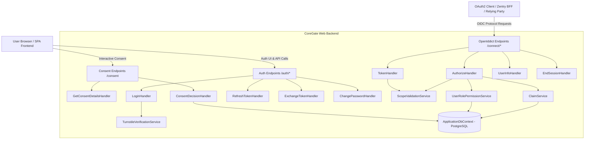
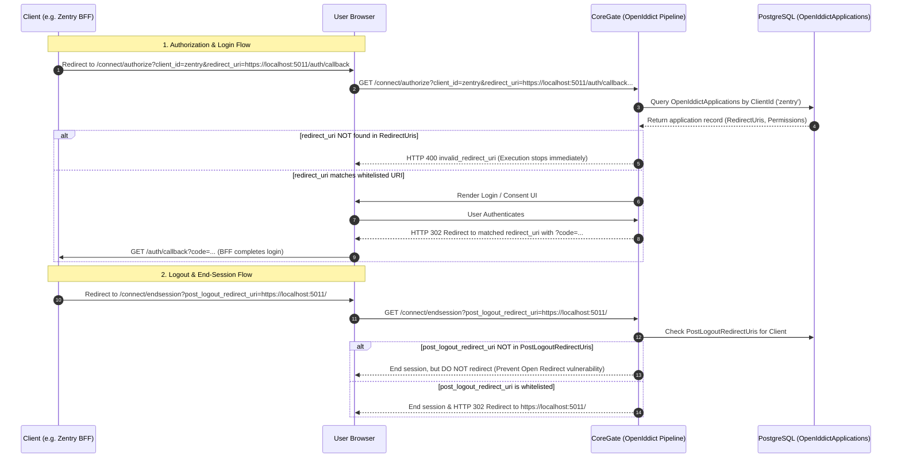

# CoreGate System Architecture & Implementation Understanding

## 1. Executive Summary & Purpose
**CoreGate** (`OpenSaur.CoreGate`) is a production-grade, centralized Authentication & Identity Provider (IdP) system built on **OpenID Connect (OIDC)** and **OAuth 2.0** standards. It manages user authentication, role-based and permission-based authorization, session management, and OAuth 2.0/OIDC token issuance for internal/external client applications (such as Zentry, Auth0, or standalone relying parties).

---

## 2. Technology Stack & Key Dependencies

### Backend (.NET Web API)
- **Target Framework**: `.NET 10` (`net10.0`)
- **Identity Engine**: [ASP.NET Core Identity](file:///d:/OpenSaur/CoreGate/src/OpenSaur.CoreGate.Web/Infrastructure/DependencyInjection/OpenIddictServiceCollectionExtensions.cs#L23) paired with Entity Framework Core.
- **OIDC/OAuth Server Engine**: [OpenIddict 7.3.0](file:///d:/OpenSaur/CoreGate/src/OpenSaur.CoreGate.Web/Infrastructure/DependencyInjection/OpenIddictServiceCollectionExtensions.cs#L66) (`OpenIddict.AspNetCore`, `OpenIddict.EntityFrameworkCore`).
- **Database**: PostgreSQL managed via [`Npgsql.EntityFrameworkCore.PostgreSQL 10.0.0`](file:///d:/OpenSaur/CoreGate/src/OpenSaur.CoreGate.Web/OpenSaur.CoreGate.Web.csproj#L22).
- **Security & Data Protection**:
  - ASP.NET Core Data Protection backed by EF Core [`DataProtectionKeys`](file:///d:/OpenSaur/CoreGate/src/OpenSaur.CoreGate.Web/Infrastructure/Database/ApplicationDbContext.cs#L38).
  - Certificate-based (or ephemeral key) signing and encryption for OIDC tokens.
  - Forwarded headers support for Azure Container Apps (ACA) ingress reverse proxy environment.

### Frontend (Embedded SPA)
- **Framework**: React 19 + TypeScript + Vite (`Frontend/`).
- **UI & Forms**: Material UI (`@mui/material`), Emotion, `react-hook-form`, `react-router-dom`.
- **Hosting Strategy**: Integrated into ASP.NET Core via `Microsoft.AspNetCore.SpaProxy` (`/auth/login`, SPA fallback).

---

## 3. Core Architecture & Component Map

---

## 4. Domain & Database Schema Model

The data layer is defined in [`ApplicationDbContext`](file:///d:/OpenSaur/CoreGate/src/OpenSaur.CoreGate.Web/Infrastructure/Database/ApplicationDbContext.cs) with custom identity entities:

1. **Identity Layer**:
   - [`ApplicationUser`](file:///d:/OpenSaur/CoreGate/src/OpenSaur.CoreGate.Web/Domain/Identity/ApplicationUser.cs): Extends `IdentityUser<Guid>`. Includes profile metadata (First Name, Last Name, Full Name, Avatar URL, Status).
   - [`Role`](file:///d:/OpenSaur/CoreGate/src/OpenSaur.CoreGate.Web/Domain/Identity/Role.cs): Extends `IdentityRole<Guid>`. Defines global roles (e.g., [`SystemRoles.Admin`](file:///d:/OpenSaur/CoreGate/src/OpenSaur.CoreGate.Web/Domain/Identity/SystemRoles.cs)).
   - [`UserRole`](file:///d:/OpenSaur/CoreGate/src/OpenSaur.CoreGate.Web/Domain/Identity/UserRole.cs): Joins `ApplicationUser` and `Role`.

2. **Permissions & Scopes**:
   - [`Permission`](file:///d:/OpenSaur/CoreGate/src/OpenSaur.CoreGate.Web/Domain/Permissions/Permission.cs): Defines granular system permissions.
   - [`PermissionScope`](file:///d:/OpenSaur/CoreGate/src/OpenSaur.CoreGate.Web/Domain/Permissions/PermissionScope.cs): Groups permissions by feature scope.
   - [`PermissionRole`](file:///d:/OpenSaur/CoreGate/src/OpenSaur.CoreGate.Web/Domain/Permissions/PermissionRole.cs): Connects Roles to Permissions.

3. **Workspaces & Multitenancy**:
   - [`Workspace`](file:///d:/OpenSaur/CoreGate/src/OpenSaur.CoreGate.Web/Domain/Workspaces/Workspace.cs) & [`WorkspaceRole`](file:///d:/OpenSaur/CoreGate/src/OpenSaur.CoreGate.Web/Domain/Workspaces/WorkspaceRole.cs): Manages workspace-level access and roles.

4. **OpenIddict Entities**:
   - Standard OpenIddict tables (`OpenIddictApplications`, `OpenIddictAuthorizations`, `OpenIddictScopes`, `OpenIddictTokens`) using `Guid` keys.

---

## 5. Endpoints & Protocol Flows

### OIDC & OAuth 2.0 Standard Endpoints ([`OpenIddictEndpoints.cs`](file:///d:/OpenSaur/CoreGate/src/OpenSaur.CoreGate.Web/Features/Auth/OpenIddictEndpoints.cs))
- `GET/POST /connect/authorize`: Handled by [`AuthorizeHandler`](file:///d:/OpenSaur/CoreGate/src/OpenSaur.CoreGate.Web/Features/Auth/Handlers/OpenIddict/AuthorizeHandler.cs).
  - Validates client application presence and dynamically checks requested scopes against client permissions via [`ScopeValidationService`](file:///d:/OpenSaur/CoreGate/src/OpenSaur.CoreGate.Web/Features/Auth/Services/ScopeValidationService.cs).
  - Inspects user consent in `OpenIddictAuthorizations`. If consent is required or `prompt=consent`, redirects browser to `/consent`.
  - Resolves workspace context (`workspace_id`) and administrative impersonation (`impersonated_user_id`).
  - Issues authorization code with claims structured for `AccessToken` and `IdentityToken`.
- `POST /connect/token`: Handled by [`TokenHandler`](file:///d:/OpenSaur/CoreGate/src/OpenSaur.CoreGate.Web/Features/Auth/Handlers/OpenIddict/TokenHandler.cs).
  - Supports `authorization_code`, `refresh_token`, and `client_credentials` flows.
  - Dynamically re-validates requested scopes on token exchange.
  - For M2M (`client_credentials`), invokes `ClaimService.BuildClientClaimPrincipalAsync` to issue machine-centric tokens without user context.
- `GET /connect/userinfo`: Handled by [`UserInfoHandler`](file:///d:/OpenSaur/CoreGate/src/OpenSaur.CoreGate.Web/Features/Auth/Handlers/OpenIddict/UserInfoHandler.cs).
  - Returns OIDC compliant user profile claims, roles, workspace identity, impersonation metadata, and granular permissions.
- `GET/POST /connect/endsession`: Handled by [`EndSessionHandler`](file:///d:/OpenSaur/CoreGate/src/OpenSaur.CoreGate.Web/Features/Auth/Handlers/OpenIddict/EndSessionHandler.cs).
  - Performs single sign-out, revokes tokens via [`EndSessionRevocationService`](file:///d:/OpenSaur/CoreGate/src/OpenSaur.CoreGate.Web/Features/Auth/Services/EndSessionRevocationService.cs), and clears session cookies.

### Interactive Consent Endpoints & React SPA ([`ConsentEndpoints.cs`](file:///d:/OpenSaur/CoreGate/src/OpenSaur.CoreGate.Web/Features/Auth/ConsentEndpoints.cs))
- `Client SPA Route /consent`: Client-side React page ([`ConsentPage.tsx`](file:///d:/OpenSaur/CoreGate/src/OpenSaur.CoreGate.Web/Frontend/src/pages/ConsentPage.tsx)) using `PageLayout`, `Card`, and CoreGate design tokens to display requesting client details, scopes list with human-friendly descriptions, and Allow/Cancel buttons.
- `GET /api/consent`: Handled by [`GetConsentDetailsHandler`](file:///d:/OpenSaur/CoreGate/src/OpenSaur.CoreGate.Web/Features/Auth/Handlers/OpenIddict/GetConsentDetailsHandler.cs). Returns client display name and requested scopes for the authenticated user.
- `POST /api/consent`: Handled by [`ConsentDecisionHandler`](file:///d:/OpenSaur/CoreGate/src/OpenSaur.CoreGate.Web/Features/Auth/Handlers/OpenIddict/ConsentDecisionHandler.cs).
  - **Accept**: Creates or updates a permanent `OpenIddictAuthorization` record in PostgreSQL (`Type = Permanent`, `Status = Valid`) and returns `{ redirectUrl }` to resume the OIDC flow.
  - **Reject**: Returns `{ redirectUrl }` with OIDC `error=access_denied`.

### SPA / Direct Authentication Endpoints ([`AuthEndpoints.cs`](file:///d:/OpenSaur/CoreGate/src/OpenSaur.CoreGate.Web/Features/Auth/AuthEndpoints.cs))
- `POST /auth/login`: Handles password authentication + Cloudflare Turnstile verification via [`TurnstileVerificationService`](file:///d:/OpenSaur/CoreGate/src/OpenSaur.CoreGate.Web/Features/Auth/Services/TurnstileVerificationService.cs). Sets identity cookie.
- `POST /auth/refresh` & `POST /auth/exchange`: Token refresh and custom token exchange handlers.
- `GET /auth/change-password/access` & `POST /auth/change-password`: Self-service password change handling.

---

## 6. Key Business Logic Services ([`Services`](file:///d:/OpenSaur/CoreGate/src/OpenSaur.CoreGate.Web/Features/Auth/Services/))
1. [`ClaimService`](file:///d:/OpenSaur/CoreGate/src/OpenSaur.CoreGate.Web/Features/Auth/Services/ClaimService.cs):
   - `BuildUserClaimPrincipalAsync`: Resolves user profile, active workspace, roles, and permissions into an authenticated `ClaimsPrincipal`.
   - `BuildClientClaimPrincipalAsync`: Constructs client-centric `ClaimsPrincipal` for M2M flows.
2. [`ScopeValidationService`](file:///d:/OpenSaur/CoreGate/src/OpenSaur.CoreGate.Web/Features/Auth/Services/ScopeValidationService.cs):
   - Dynamically validates requested scopes against permissions assigned to the client application in OpenIddict (`scp:scope_name`).
3. [`UserRolePermissionService`](file:///d:/OpenSaur/CoreGate/src/OpenSaur.CoreGate.Web/Features/Auth/Services/UserRolePermissionService.cs):
   - Resolves user permissions from DB across global system roles and workspace roles.
4. [`CookieService`](file:///d:/OpenSaur/CoreGate/src/OpenSaur.CoreGate.Web/Features/Auth/Services/CookieService.cs):
   - Configures domain-normalized session cookies for seamless multi-subdomain Auth/SSO.
5. [`TokenService`](file:///d:/OpenSaur/CoreGate/src/OpenSaur.CoreGate.Web/Features/Auth/Services/TokenService.cs):
   - Helper for internal HTTP calls and token lifecycle.

---

## 7. OpenIddict Claims & Destination Architecture

Claim destinations are mapped in [`ClaimPrincipalHelpers.cs`](file:///d:/OpenSaur/CoreGate/src/OpenSaur.CoreGate.Web/Infrastructure/Security/ClaimPrincipalHelpers.cs#L100-L126). In OpenIddict, a claim is only written into a token if explicitly assigned via `principal.SetDestinations`.

CoreGate routes claims across token destinations as follows:

| Claim Type | Standard / OIDC Name | Destinations | Gatekeeping Condition |
| :--- | :--- | :--- | :--- |
| `ClaimTypes.Subject` | `sub` | `AccessToken`, `IdentityToken` | Always included |
| `ClaimTypes.Name` | `name` | `AccessToken`, `IdentityToken` | `profile` scope present |
| `ClaimTypes.PreferredUserName` | `preferred_username` | `AccessToken`, `IdentityToken` | `profile` scope present |
| `OpenIddictConstants.Claims.Email` | `email` | `AccessToken`, `IdentityToken` | `email` scope present |
| `ClaimTypes.Role` | `roles` | `AccessToken`, `IdentityToken` | `roles` scope present |
| `ClaimTypes.Permissions` | `permissions` | `AccessToken`, `IdentityToken` | `api` scope present |
| `ClaimTypes.WorkspaceId` | `workspace_id` | `AccessToken`, `IdentityToken` | Always included (authenticated user) |
| `ClaimTypes.WorkspaceName` | `workspace_name` | `AccessToken`, `IdentityToken` | Always included (authenticated user) |
| `ClaimTypes.ImpersonationOriginalUserId` | `impersonation_original_user_id` | `AccessToken`, `IdentityToken` | Impersonation active |
| `ClaimTypes.RequirePasswordChange` | `require_password_change` | `AccessToken` only | Always included on access token |

---

## 8. Client Scopes & Relying Party Claim Consumption Matrix

The following matrix documents all supported client scopes, their security gating rules in CoreGate, the claims emitted to `access_token`, `id_token`, and `/connect/userinfo`, and how consuming client applications (such as Zentry) utilize them:

| Scope | Claims Emitted by CoreGate | CoreGate Gating Condition (`SetDestinations`) | Relying Party Usage (e.g. Zentry) |
| :--- | :--- | :--- | :--- |
| **`openid`** | `sub`, `workspace_id`, `workspace_name`, `impersonation_original_user_id` | Core OIDC mandatory scope | Resolves user identifier (`GetCurrentUserId`), active tenant (`GetWorkspaceId`), and whether an administrative impersonation session is active (`IsImpersonating`). |
| **`profile`** | `name`, `preferred_username` | `profileIdentity.HasScope("profile")` | Standard ASP.NET Core identity name (`Identity.Name`) and UI profile displays. |
| **`email`** | `email` | `emailIdentity.HasScope("email")` | User contact information and profile views. |
| **`roles`** | `roles` | `roleIdentity.HasScope("roles")` | Role-based authorization policies (e.g. `SuperAdminOnly` policy and `IsSuperAdministrator`). |
| **`api`** | `permissions`, resource audience (`aud: api`) | `permissionIdentity.HasScope("api")` | Granular permission policies (e.g. `AdminCanManagePolicy` and `HasPermission`). |
| **`offline_access`** | `refresh_token` | Granted if client allows refresh token flow | Background sliding session renewal in BFF middleware (`BffTokenRefreshCookieEvents`) without prompting the user to re-authenticate. |

---

## 9. OIDC Client Registration & URL Redirection Verification

CoreGate relies on OpenIddict's database model (`OpenIddictApplications` table in PostgreSQL) to manage registered client applications (such as Zentry, Umbraco, and CashPilot). Every authorization request, token exchange, and logout redirection is validated strictly against this database record.

### 9.1 Application Registration Schema (`OpenIddictApplications`)
When an application is configured in CoreGate (via UI or seed data), it stores:
- **`ClientId`**: Unique identifier (e.g. `zentry`).
- **`Type`**: `public` (Public client with PKCE, secret not required) or `confidential` (requires hashed client secret).
- **`Permissions`**: Authorized endpoints (`ept:authorization`, `ept:token`, `ept:endsession`), grant types (`gt:authorization_code`, `gt:refresh_token`), and scopes (`scp:openid`, `scp:profile`, `scp:email`, `scp:roles`, `scp:offline_access`, `scp:api`).
- **`RedirectUris`**: JSON array of absolute URIs where CoreGate is permitted to send authorization codes.
- **`PostLogoutRedirectUris`**: JSON array of absolute URIs where CoreGate is permitted to redirect users after single sign-out.

### 9.2 How Redirection Validation Works Under the Hood

### 9.3 Key Architectural Principles
1. **OpenIddict Pipeline Interception**: 
   Redirect URI and Post-Logout Redirect URI verification occurs inside OpenIddict's pre-pipeline middleware handlers (`ValidateAuthorizeRequestContext` and `ValidateRedirectUri`) **before** the request reaches any application-level endpoint handler (e.g., `AuthorizeHandler.cs`). If a URI is not whitelisted, the request is terminated immediately with `invalid_redirect_uri`.
2. **Protection Against Authorization Code Hijacking**:
   Without strict database validation of `redirect_uri`, an attacker could supply an external malicious URL (`?redirect_uri=https://attacker.com/steal`) to steal authorization codes and impersonate users.
3. **Protection Against Open Redirect Attacks**:
   Validating `post_logout_redirect_uri` against `PostLogoutRedirectUris` ensures that attackers cannot trick users into logging out and being silently redirected to phishing websites.
4. **Client-Side Coupling (`RedirectPath` & `PostLogoutRedirectPath`)**:
   In client applications like Zentry, settings such as `Oidc:RedirectPath` (`/auth/callback`) and `Oidc:PostLogoutRedirectPath` (`/`) serve two purposes:
   - They configure the client's local middleware to listen for incoming callbacks.
   - They are combined with the client's base address to form the exact `redirect_uri` and `post_logout_redirect_uri` parameters that CoreGate verifies against its database.

---

## 10. Caching Architecture (.NET 10 HybridCache & `ICacheService`)

CoreGate encapsulates all caching logic behind [`ICacheService`](file:///d:/OpenSaur/CoreGate/src/OpenSaur.CoreGate.Web/Infrastructure/Caching/CacheService.cs), backed by .NET 10 `HybridCache` ([`CacheServiceCollectionExtensions.cs`](file:///d:/OpenSaur/CoreGate/src/OpenSaur.CoreGate.Web/Infrastructure/DependencyInjection/CacheServiceCollectionExtensions.cs)):

1. **Centralized Service Abstraction (`ICacheService`)**:
   - Adheres to Single Responsibility and Dependency Inversion principles. Domain services inject `ICacheService` without coupling to `HybridCacheEntryOptions` or caching internals.
   - Centralizes default TTLs: `DefaultCacheExpiration = 10 minutes` (Redis L2), `DefaultLocalCacheExpiration = 30 seconds` (in-memory L1), both overridable via optional parameters.
2. **Distributed Fallback**:
   - Reads `ConnectionStrings:Redis`. If configured, connects to Redis with prefix `CoreGate:`.
   - If Redis is unconfigured or unavailable, automatically falls back to `AddDistributedMemoryCache()`.
3. **Centralized Keys & Tags ([`CacheKeys.cs`](file:///d:/OpenSaur/CoreGate/src/OpenSaur.CoreGate.Web/Infrastructure/Caching/CacheKeys.cs))**:
   - `CacheKeys.UserWorkspaceRoles(userId, workspaceId)`: Caches active normalized user roles per workspace.
   - `CacheKeys.UserWorkspacePermissions(userId, workspaceId)`: Caches granted permission codes per workspace.
   - `CacheKeys.UserCanImpersonate(userId)`: Caches administrative super-admin status.
   - `CacheKeys.Workspace(workspaceId)`: Caches workspace entity metadata (`WorkspaceCacheModel`).
   - `CacheKeys.ClientPermissions(clientId)`: Caches registered OpenIddict client application permissions.
4. **Multi-Node L1 Staleness Mitigation**:
   - In-memory L1 `LocalCacheExpiration` defaults to **30 seconds**, while distributed L2 (`IDistributedCache` / Redis) retains entries for 10 minutes.
   - This ensures rapid microsecond in-process serving for bursts of auth calls while keeping any cross-node discrepancy window to at most 30 seconds, without requiring custom Pub/Sub synchronization plumbing.
5. **Cache Invalidation Tags**:
   - Tagged with `CacheKeys.Tags.User(userId)`, `CacheKeys.Tags.Workspace(workspaceId)`, and `CacheKeys.Tags.Client(clientId)`.

---

## 11. Configuration & Environment Settings
- Defined across [`appsettings.json`](file:///d:/OpenSaur/CoreGate/src/OpenSaur.CoreGate.Web/appsettings.json), [`appsettings.Development.json`](file:///d:/OpenSaur/CoreGate/src/OpenSaur.CoreGate.Web/appsettings.Development.json), and [`appsettings.Production.json`](file:///d:/OpenSaur/CoreGate/src/OpenSaur.CoreGate.Web/appsettings.Production.json).
- Key config sections: `ConnectionStrings` (including optional `Redis`), `Oidc`, `AuthCookie`, `CorsOptions`, `TurnstileOptions`.

