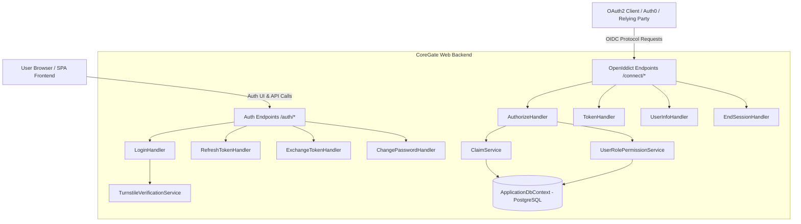

# CoreGate System Architecture & Implementation Understanding

## 1. Executive Summary & Purpose
**CoreGate** (`OpenSaur.CoreGate`) is a production-grade, centralized Authentication & Identity Provider (IdP) system built on **OpenID Connect (OIDC)** and **OAuth 2.0** standards. It manages user authentication, role-based and permission-based authorization, session management, and OAuth 2.0/OIDC token issuance for internal/external client applications (such as Auth0 or standalone relying parties).

---

## 2. Technology Stack & Key Dependencies

### Backend (.NET Web API)
- **Target Framework**: `.NET 10` (`net10.0`)
- **Identity Engine**: [ASP.NET Core Identity](file:///d:/OpenSaur/CoreGate/src/OpenSaur.CoreGate.Web/Infrastructure/DependencyInjection/OpenIddictServiceCollectionExtensions.cs#L23) paired with Entity Framework Core.
- **OIDC/OAuth Server Engine**: [OpenIddict 7.3.0](file:///d:/OpenSaur/CoreGate/src/OpenSaur.CoreGate.Web/Infrastructure/DependencyInjection/OpenIddictServiceCollectionExtensions.cs#L66) (`OpenIddict.AspNetCore`, `OpenIddict.EntityFrameworkCore`).
- **Database**: PostgreSQL managed via [`Npgsql.EntityFrameworkCore.PostgreSQL 10.0.0`](file:///d:/OpenSaur/CoreGate/src/OpenSaur.CoreGate.Web/OpenSaur.CoreGate.Web.csproj#L22).
- **Security & Data Protection**:
  - ASP.NET Core Data Protection backed by EF Core [`DataProtectionKeys`](file:///d:/OpenSaur/CoreGate/src/OpenSaur.CoreGate.Web/Infrastructure/Database/ApplicationDbContext.cs#L38).
  - Certificate-based (or ephemeral key) signing and encryption for OIDC tokens.
  - Forwarded headers support for Azure Container Apps (ACA) ingress reverse proxy environment.

### Frontend (Embedded SPA)
- **Framework**: React 19 + TypeScript + Vite (`Frontend/`).
- **UI & Forms**: Material UI (`@mui/material`), Emotion, `react-hook-form`, `react-router-dom`.
- **Hosting Strategy**: Integrated into ASP.NET Core via `Microsoft.AspNetCore.SpaProxy` (`/auth/login`, SPA fallback).

---

## 3. Core Architecture & Component Map

---

## 4. Domain & Database Schema Model

The data layer is defined in [`ApplicationDbContext`](file:///d:/OpenSaur/CoreGate/src/OpenSaur.CoreGate.Web/Infrastructure/Database/ApplicationDbContext.cs) with custom identity entities:

1. **Identity Layer**:
   - [`ApplicationUser`](file:///d:/OpenSaur/CoreGate/src/OpenSaur.CoreGate.Web/Domain/Identity/ApplicationUser.cs): Extends `IdentityUser<Guid>`. Includes profile metadata (First Name, Last Name, Full Name, Avatar URL, Status).
   - [`Role`](file:///d:/OpenSaur/CoreGate/src/OpenSaur.CoreGate.Web/Domain/Identity/Role.cs): Extends `IdentityRole<Guid>`. Defines global roles (e.g., [`SystemRoles.Admin`](file:///d:/OpenSaur/CoreGate/src/OpenSaur.CoreGate.Web/Domain/Identity/SystemRoles.cs)).
   - [`UserRole`](file:///d:/OpenSaur/CoreGate/src/OpenSaur.CoreGate.Web/Domain/Identity/UserRole.cs): Joins `ApplicationUser` and `Role`.

2. **Permissions & Scopes**:
   - [`Permission`](file:///d:/OpenSaur/CoreGate/src/OpenSaur.CoreGate.Web/Domain/Permissions/Permission.cs): Defines granual system permissions.
   - [`PermissionScope`](file:///d:/OpenSaur/CoreGate/src/OpenSaur.CoreGate.Web/Domain/Permissions/PermissionScope.cs): Groups permissions by feature scope.
   - [`PermissionRole`](file:///d:/OpenSaur/CoreGate/src/OpenSaur.CoreGate.Web/Domain/Permissions/PermissionRole.cs): Connects Roles to Permissions.

3. **Workspaces & Multitenancy**:
   - [`Workspace`](file:///d:/OpenSaur/CoreGate/src/OpenSaur.CoreGate.Web/Domain/Workspaces/Workspace.cs) & [`WorkspaceRole`](file:///d:/OpenSaur/CoreGate/src/OpenSaur.CoreGate.Web/Domain/Workspaces/WorkspaceRole.cs): Manages workspace-level access and roles.

4. **OpenIddict Entities**:
   - Standard OpenIddict tables (`OpenIddictApplications`, `OpenIddictAuthorizations`, `OpenIddictScopes`, `OpenIddictTokens`) using `Guid` keys.

---

## 5. Endpoints & Protocol Flows

### OIDC & OAuth 2.0 Standard Endpoints ([`OpenIddictEndpoints.cs`](file:///d:/OpenSaur/CoreGate/src/OpenSaur.CoreGate.Web/Features/Auth/OpenIddictEndpoints.cs))
- `GET/POST /connect/authorize`: Handled by [`AuthorizeHandler`](file:///d:/OpenSaur/CoreGate/src/OpenSaur.CoreGate.Web/Features/Auth/Handlers/OpenIddict/AuthorizeHandler.cs). Processes authorization code request, validates session/cookie authentication, builds security principal with claims/roles, returns authorization code.
- `POST /connect/token`: Handled by [`TokenHandler`](file:///d:/OpenSaur/CoreGate/src/OpenSaur.CoreGate.Web/Features/Auth/Handlers/OpenIddict/TokenHandler.cs). Exchanges authorization code or refresh token for JWT access token and refresh token.
- `GET /connect/userinfo`: Handled by [`UserInfoHandler`](file:///d:/OpenSaur/CoreGate/src/OpenSaur.CoreGate.Web/Features/Auth/Handlers/OpenIddict/UserInfoHandler.cs). Returns OIDC compliant user profile claims.
- `GET/POST /connect/endsession`: Handled by [`EndSessionHandler`](file:///d:/OpenSaur/CoreGate/src/OpenSaur.CoreGate.Web/Features/Auth/Handlers/OpenIddict/EndSessionHandler.cs). Performs single sign-out, revokes tokens via [`EndSessionRevocationService`](file:///d:/OpenSaur/CoreGate/src/OpenSaur.CoreGate.Web/Features/Auth/Services/EndSessionRevocationService.cs), clears session cookies.

### SPA / direct Authentication Endpoints ([`AuthEndpoints.cs`](file:///d:/OpenSaur/CoreGate/src/OpenSaur.CoreGate.Web/Features/Auth/AuthEndpoints.cs))
- `POST /auth/login`: Handles password login + Cloudflare Turnstile captcha check via [`TurnstileVerificationService`](file:///d:/OpenSaur/CoreGate/src/OpenSaur.CoreGate.Web/Features/Auth/Services/TurnstileVerificationService.cs). Sets identity cookie.
- `POST /auth/refresh` & `POST /auth/exchange`: Token refresh and custom token exchange handlers.
- `GET /auth/change-password/access` & `POST /auth/change-password`: Self-service password change handling.

---

## 6. Key Business Logic Services ([`Services`](file:///d:/OpenSaur/CoreGate/src/OpenSaur.CoreGate.Web/Features/Auth/Services/))
1. [`ClaimService`](file:///d:/OpenSaur/CoreGate/src/OpenSaur.CoreGate.Web/Features/Auth/Services/ClaimService.cs): Standardizes token claims generation (user id, email, full name, system roles, permissions, workspaces).
2. [`UserRolePermissionService`](file:///d:/OpenSaur/CoreGate/src/OpenSaur.CoreGate.Web/Features/Auth/Services/UserRolePermissionService.cs): Resolves user permissions from DB across system roles and workspace roles.
3. [`CookieService`](file:///d:/OpenSaur/CoreGate/src/OpenSaur.CoreGate.Web/Features/Auth/Services/CookieService.cs): Configures domain-normalized session cookies for seamless multi-subdomain Auth/SSO.
4. [`TokenService`](file:///d:/OpenSaur/CoreGate/src/OpenSaur.CoreGate.Web/Features/Auth/Services/TokenService.cs): Helper for internal HTTP calls and token lifecycle.

---

## 7. Configuration & Environment Settings
- Defined across [`appsettings.json`](file:///d:/OpenSaur/CoreGate/src/OpenSaur.CoreGate.Web/appsettings.json), [`appsettings.Development.json`](file:///d:/OpenSaur/CoreGate/src/OpenSaur.CoreGate.Web/appsettings.Development.json), and [`appsettings.Production.json`](file:///d:/OpenSaur/CoreGate/src/OpenSaur.CoreGate.Web/appsettings.Production.json).
- Key config sections: `ConnectionStrings`, `Oidc`, `AuthCookie`, `CorsOptions`, `TurnstileOptions`.
