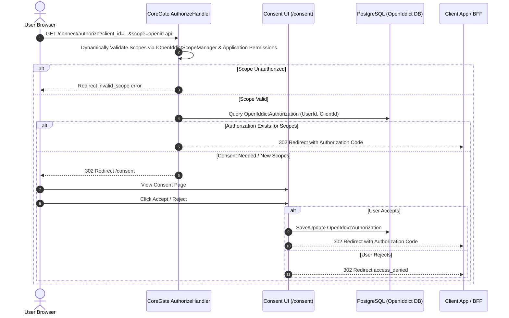

# CoreGate Design Specification: M2M Flow, User Consent Screen & Scope Validation

**Date**: 2026-09-17  
**Status**: Approved (Dynamic Scope Update)  
**Target Systems**: `OpenSaur.CoreGate.Web` (.NET 10, OpenIddict 7.3.0, PostgreSQL)

---

## 1. Executive Summary
This design specification defines three major protocol and security enhancements to the CoreGate Identity & OIDC provider:
1. **Dynamic Scope Validation & Client Application Permissions**: Dynamic validation of requested scopes against OpenIddict registered scopes (`IOpenIddictScopeManager`) and client application permissions (`IOpenIddictApplicationManager`), returning `invalid_scope` on unauthorized or unrecognized requests.
2. **Machine-to-Machine (M2M) Client Credentials Flow**: Full support for `grant_type=client_credentials` in OpenIddict, issuing application-centric JWT access tokens for Backend-For-Frontend (BFF) and service-to-service communication.
3. **Interactive OAuth2 User Consent Screen**: Interactive authorization prompt and persistent scope approval handling via `OpenIddictAuthorization` records.

---

## 2. Feature 1: Dynamic Scope Validation & Client Application Permissions

### 2.1 Dynamic Scope Registry & Application Permissions
- **Standard OIDC Scopes**: `openid`, `profile`, `email`, `offline_access`, `roles`.
- **Dynamic Scopes**: Any custom API scope (e.g. `api`, `read:data`, `write:orders`) stored and managed dynamically in PostgreSQL via `IOpenIddictScopeManager`.
- **Client Application Permissions**: Each client application registered in OpenIddict (`OpenIddictApplication`) dynamically specifies its permitted scopes using OpenIddict permission strings (e.g. `OpenIddictConstants.Permissions.Prefixes.Scope + scopeName`).

### 2.2 Validation Flow
In [`AuthorizeHandler.cs`](file:///d:/OpenSaur/CoreGate/src/OpenSaur.CoreGate.Web/Features/Auth/Handlers/OpenIddict/AuthorizeHandler.cs) and [`TokenHandler.cs`](file:///d:/OpenSaur/CoreGate/src/OpenSaur.CoreGate.Web/Features/Auth/Handlers/OpenIddict/TokenHandler.cs):
1. Extract requested scopes from `request.GetScopes()`.
2. Query `IOpenIddictScopeManager` to dynamically verify that every requested scope exists in the database/server registry.
3. Query `IOpenIddictApplicationManager` to dynamically verify that every requested scope is explicitly granted to the requesting client application.
4. If any scope is unrecognized or not granted to the client application:
   - Abort processing immediately.
   - Return standard OIDC error: `invalid_scope` with description `"The requested scope is invalid, unknown, or unauthorized for this client application."`.

---

## 3. Feature 2: Machine-to-Machine (M2M) Client Credentials Flow

### 3.1 Server Configuration
- In [`OpenIddictServiceCollectionExtensions.cs`](file:///d:/OpenSaur/CoreGate/src/OpenSaur.CoreGate.Web/Infrastructure/DependencyInjection/OpenIddictServiceCollectionExtensions.cs):
  - Add `options.AllowClientCredentialsFlow()`.

### 3.2 Token Request Processing
- In [`TokenHandler.cs`](file:///d:/OpenSaur/CoreGate/src/OpenSaur.CoreGate.Web/Features/Auth/Handlers/OpenIddict/TokenHandler.cs):
  - Allow `request.IsClientCredentialsGrantType()`.
  - Validate `client_id` and `client_secret` via OpenIddict server middleware.
  - Perform dynamic scope validation against client permissions.

### 3.3 Claims & Token Structure for M2M
- Construct a `ClaimsPrincipal` for the client application:
  - `sub`: `client_id` (e.g., `"bff-service"`)
  - `client_id`: `client_id`
  - `scope`: Granted client scopes
  - `permissions`: Assigned application permissions
- Exclude user-specific claims (`email`, `workspace_id` for individual users, human profile metadata).

---

## 4. Feature 3: Interactive OAuth2 User Consent Screen

### 4.1 Authorization & Consent Detection
- In [`AuthorizeHandler.cs`](file:///d:/OpenSaur/CoreGate/src/OpenSaur.CoreGate.Web/Features/Auth/Handlers/OpenIddict/AuthorizeHandler.cs):
  - Inspect existing authorizations for `(UserId, ClientId)` using `IOpenIddictAuthorizationManager`.
  - If existing authorization contains all requested scopes and `prompt != "consent"`, bypass consent screen and issue authorization code immediately.
  - If existing authorization is missing any requested scope or `prompt == "consent"`, store parameters and redirect browser to `/consent`.

### 4.2 Consent UI & Endpoints
- Implement consent endpoint `/consent` rendering a clean HTML form showing:
  - Client Application Display Name.
  - List of requested scopes / permissions.
  - Action buttons: **Accept** and **Reject**.
- **On Accept**:
  - Create or update persistent `OpenIddictAuthorization` record in PostgreSQL (`Type = Permanent`, `Status = Valid`).
  - Resume authorization flow and return authorization code.
- **On Reject**:
  - Return OIDC `access_denied` error redirect to the client's `redirect_uri`.

---

## 5. Architectural Component Map

