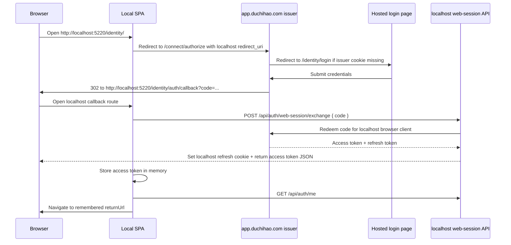

# Identity Login Flows

This document explains the login flows currently implemented in `OpenSaur.Identity.Web`.

It covers:

- the first-party hosted app flow on `https://app.duchihao.com/identity`
- the localhost-initiated first-party flow on `http://localhost:5220/identity`
- the issuer-hosted impersonation round-trip for first-party apps
- the token and cookie boundaries between issuer and client hosts
- the backend-assisted refresh flow
- the standard third-party OpenID Connect flow
- the preference and localization behavior for issuer handoff screens

## Purpose

This service plays two roles at the same time:

- **OIDC issuer**
  - exposes `/connect/authorize`, `/connect/token`, and related endpoints
  - authenticates the user with ASP.NET Core Identity
  - issues authorization codes and tokens

- **first-party browser app host**
  - serves the React shell under `/identity`
  - stores the access token in frontend memory
  - keeps the refresh token in an `HttpOnly` cookie

The first-party browser flow is intentionally different from a normal third-party OIDC client because the frontend must never receive the refresh token directly.

## Main Runtime Pieces

### Frontend

- router: `src/OpenSaur.Identity.Web/client/src/app/router/AppRouter.tsx`
- auth guard: `src/OpenSaur.Identity.Web/client/src/features/auth/components/ProtectedRoute.tsx`
- bootstrap boundary: `src/OpenSaur.Identity.Web/client/src/features/auth/components/AuthBootstrapBoundary.tsx`
- login page: `src/OpenSaur.Identity.Web/client/src/pages/login/LoginPage.tsx`
- callback page: `src/OpenSaur.Identity.Web/client/src/pages/auth-callback/AuthCallbackPage.tsx`
- OIDC URL builder: `src/OpenSaur.Identity.Web/client/src/features/auth/utils/firstPartyOidc.ts`
- runtime client/redirect selection: `src/OpenSaur.Identity.Web/client/src/shared/config/env.ts`
- in-memory auth state: `src/OpenSaur.Identity.Web/client/src/features/auth/state/authSessionStore.ts`

### Backend

- app path-base and endpoint wiring: `src/OpenSaur.Identity.Web/Program.cs`
- OIDC authorize endpoint: `src/OpenSaur.Identity.Web/Features/Auth/Oidc/OidcEndpoints.cs`
- login API: `src/OpenSaur.Identity.Web/Features/Auth/Login/LoginHandler.cs`
- auth endpoint map: `src/OpenSaur.Identity.Web/Features/Auth/AuthEndpoints.cs`
- code exchange API: `src/OpenSaur.Identity.Web/Features/Auth/WebSession/ExchangeWebSessionHandler.cs`
- refresh API: `src/OpenSaur.Identity.Web/Features/Auth/WebSession/RefreshWebSessionHandler.cs`
- issuer-hosted login redirect policy: `src/OpenSaur.Identity.Web/Infrastructure/DependencyInjection.cs`
- first-party token backchannel: `src/OpenSaur.Identity.Web/Infrastructure/Oidc/FirstPartyOidcTokenClient.cs`
- redirect-uri helpers: `src/OpenSaur.Identity.Web/Infrastructure/Oidc/OidcOptionsExtensions.cs`
- OIDC client registration: `src/OpenSaur.Identity.Web/Infrastructure/Oidc/FirstPartyOidcClientRegistrar.cs`
- first-party client configuration: `src/OpenSaur.Identity.Web/Infrastructure/Oidc/OidcOptions.cs`

## Browser Client

The current implementation registers one first-party browser client:

- `first-party-web`
  - hosted app callback: `https://app.duchihao.com/identity/auth/callback`
  - localhost callback: `http://localhost:5220/identity/auth/callback`

These are configured in:

- `src/OpenSaur.Identity.Web/appsettings.Development.json`
- `src/OpenSaur.Identity.Web/appsettings.Production.json`
- `src/OpenSaur.Identity.Web/appsettings.json`

At runtime, the frontend always uses `first-party-web`, while `resolveFirstPartyRedirectUri()` in `src/OpenSaur.Identity.Web/client/src/shared/config/env.ts` chooses the callback URI from the current origin.

## Localization And Preferences

The first-party auth shell localizes login, callback, and issuer-handoff screens through the frontend preference provider:

- provider: `src/OpenSaur.Identity.Web/client/src/features/preferences/PreferenceProvider.tsx`
- translation resources: `src/OpenSaur.Identity.Web/client/src/features/localization/resources.ts`
- auth handoff UI: `src/OpenSaur.Identity.Web/client/src/pages/login/LoginPage.tsx`
- callback UI: `src/OpenSaur.Identity.Web/client/src/pages/auth-callback/AuthCallbackPage.tsx`

Important boundary:

- preference cache is stored in `window.localStorage` under `opensaur.identity.preferences`
- localStorage is origin-scoped, so `https://app.duchihao.com` and `http://localhost:5220` do not share the same cached preference entry
- after a successful callback on a host, `useSyncAuthenticatedPreferences()` fetches `/api/auth/settings` and persists the authenticated user's locale/time zone into that host's localStorage

That means:

- the issuer-handoff screen on `localhost` can only use the last locale that `localhost` itself stored, or its local fallback
- the hosted issuer shell on `app.duchihao.com` can only use the last locale that host stored, or its local fallback
- once a host completes a successful sign-in and settings sync, later auth handoff screens on that same host should render with that host's cached locale

## High-Level Comparison

| Topic | Hosted first-party app | Localhost first-party app | Third-party client |
|---|---|---|---|
| Browser app served by this service | Yes | Yes | No |
| Starts at `/identity/login` | Yes | Yes | No |
| Uses `/connect/authorize` | Yes | Yes | Yes |
| Uses backend-assisted `/api/auth/web-session/exchange` | Yes | Yes | No |
| Uses backend-assisted `/api/auth/web-session/refresh` | Yes | Yes | No |
| Access token returned to browser JS | Yes | Yes | Usually yes |
| Refresh token exposed to browser JS | No | No | Depends on client |
| Refresh token stored in `HttpOnly` cookie | Yes | Yes | Client-owned |

## Localhost-Initiated First-Party Flow

This is the flow when the browser starts on `http://localhost:5220/identity`.

### Sequence Diagram

### Step-by-Step With Code References

1. Browser opens `http://localhost:5220/identity/`.
   - Path-base `/identity` is applied in `Program.cs`.
   - SPA routes are defined in `AppRouter.createAppRouter()` in `src/OpenSaur.Identity.Web/client/src/app/router/AppRouter.tsx`.

2. The auth guard detects there is no authenticated first-party access token.
   - `ProtectedRoute()` in `src/OpenSaur.Identity.Web/client/src/features/auth/components/ProtectedRoute.tsx`
   - `AuthBootstrapBoundary()` and `useAuthBootstrap()` in:
     - `src/OpenSaur.Identity.Web/client/src/features/auth/components/AuthBootstrapBoundary.tsx`
     - `src/OpenSaur.Identity.Web/client/src/features/auth/hooks/useAuthBootstrap.ts`

3. The SPA navigates to `/login?returnUrl=...`.
   - `ProtectedRoute()` writes the current route into `authSessionStore.rememberReturnUrl(...)`.
   - State store lives in `src/OpenSaur.Identity.Web/client/src/features/auth/state/authSessionStore.ts`.

4. `LoginPage()` builds the first-party authorize URL.
   - `LoginPage()` in `src/OpenSaur.Identity.Web/client/src/pages/login/LoginPage.tsx`
   - `buildFirstPartyAuthorizeUrl()` and `createFirstPartyAuthorizationState()` in `src/OpenSaur.Identity.Web/client/src/features/auth/utils/firstPartyOidc.ts`
   - `resolveFirstPartyRedirectUri()` in `src/OpenSaur.Identity.Web/client/src/shared/config/env.ts`

5. The browser is redirected to the issuer authorize endpoint.
   - `startFirstPartyAuthorization()` in `src/OpenSaur.Identity.Web/client/src/features/auth/utils/firstPartyOidc.ts`
   - Browser receives:
     - `client_id=first-party-web`
     - `redirect_uri=http://localhost:5220/identity/auth/callback`

6. The issuer receives the authorize request at `/connect/authorize`.
   - Endpoint mapping: `MapOidcEndpoints()` in `src/OpenSaur.Identity.Web/Features/Auth/Oidc/OidcEndpoints.cs`
   - Current OIDC request is resolved via `httpContext.GetOpenIddictServerRequest()`

7. If the user is not signed in on the issuer host, the authorize endpoint challenges the ASP.NET Identity cookie scheme.
   - `AuthenticateAsync(IdentityConstants.ApplicationScheme)` in `OidcEndpoints.cs`
   - If authentication fails, `Results.Challenge(...)` is returned from `OidcEndpoints.cs`

8. The cookie middleware rewrites the challenge to the issuer-hosted login page.
   - `OnRedirectToLogin` in `src/OpenSaur.Identity.Web/Infrastructure/DependencyInjection.cs`
   - `BuildIssuerHostedLoginRedirectUri(...)` in the same file preserves the interrupted authorize request as `returnUrl`

9. The hosted login page renders on `https://app.duchihao.com/identity/login`.
   - Route `/login` in `AppRouter.tsx`
   - `LoginPage()` detects issuer-hosted mode with `isCurrentAppHostedByIssuer()`

10. The user submits credentials.
    - `handleSubmit()` in `src/OpenSaur.Identity.Web/client/src/pages/login/LoginPage.tsx`
    - `useLogin()` in `src/OpenSaur.Identity.Web/client/src/features/auth/hooks/useLogin.ts`
    - `login()` in `src/OpenSaur.Identity.Web/client/src/features/auth/api/authApi.ts`
    - backend route `POST /api/auth/login` mapped in `src/OpenSaur.Identity.Web/Features/Auth/AuthEndpoints.cs`
    - backend handler `LoginHandler.HandleAsync()` in `src/OpenSaur.Identity.Web/Features/Auth/Login/LoginHandler.cs`

11. The issuer-hosted Identity cookie is established.
    - `signInManager.SignInAsync(...)` in `LoginHandler.cs`
    - cookie scheme is configured in `src/OpenSaur.Identity.Web/Infrastructure/DependencyInjection.cs`
    - this is framework-backed ASP.NET Identity cookie issuance

12. The hosted login page resumes the interrupted authorize request.
    - `isFirstPartyAuthorizeReturnUrl()` in `firstPartyOidc.ts`
    - `window.location.assign(normalizedReturnUrl)` in `LoginPage.tsx`

13. The issuer authorize endpoint runs again, now with an authenticated Identity cookie.
    - `OidcEndpoints.cs` loads the user, workspace, and roles
    - `AuthSessionPrincipalFactory.Create(...)` builds the claims principal
    - `Results.SignIn(..., OpenIddictServerAspNetCoreDefaults.AuthenticationScheme)` tells OpenIddict to finish the authorize flow

14. OpenIddict issues an authorization code and redirects the browser to localhost.
    - The callback URL used is the exact `redirect_uri` from the authorize request:
      `http://localhost:5220/identity/auth/callback?code=...&state=...`
    - Code issuance and redirect are framework behavior driven by `Results.SignIn(...)`

15. The localhost callback page starts session completion.
    - `AuthCallbackPage()` in `src/OpenSaur.Identity.Web/client/src/pages/auth-callback/AuthCallbackPage.tsx`
    - It reads `code` and OIDC `state`
    - It uses `readFirstPartyAuthorizationReturnUrl(...)` from `firstPartyOidc.ts`

16. The callback page posts the code to same-origin localhost backend.
    - `useExchangeWebSession()` in `src/OpenSaur.Identity.Web/client/src/features/auth/hooks/useExchangeWebSession.ts`
    - `exchangeWebSession()` in `src/OpenSaur.Identity.Web/client/src/features/auth/api/authApi.ts`
    - HTTP client is same-origin with `withCredentials: true` in `src/OpenSaur.Identity.Web/client/src/shared/api/httpClient.ts`

17. The localhost backend redeems the code for the localhost browser client.
    - route: `POST /api/auth/web-session/exchange`
    - map: `src/OpenSaur.Identity.Web/Features/Auth/AuthEndpoints.cs`
    - handler: `src/OpenSaur.Identity.Web/Features/Auth/WebSession/ExchangeWebSessionHandler.cs`
    - callback URI is reconstructed from current host by `BuildFirstPartyRedirectUri()` in `src/OpenSaur.Identity.Web/Infrastructure/Oidc/OidcOptionsExtensions.cs`
    - token redemption is performed by `ExchangeAuthorizationCodeAsync(...)` in `src/OpenSaur.Identity.Web/Infrastructure/Oidc/FirstPartyOidcTokenClient.cs`
    - the local backend calls the configured issuer's `/connect/token` endpoint over HTTP instead of using in-process OpenIddict server internals
    - the callback URI is validated against the configured first-party client by `GetFirstPartyClient(redirectUri)` in `src/OpenSaur.Identity.Web/Infrastructure/Oidc/OidcOptions.cs`

18. The localhost backend sets the localhost refresh cookie and returns the access token.
    - refresh cookie set in `ExchangeWebSessionHandler.cs`
    - access token JSON response also returned from `ExchangeWebSessionHandler.cs`

19. The SPA stores the access token in memory and bootstraps current user state.
    - `authSessionStore.setAuthenticatedSession(...)` in `src/OpenSaur.Identity.Web/client/src/features/auth/state/authSessionStore.ts`
    - `fetchCurrentUser()` from `useCurrentUserQuery()` in `src/OpenSaur.Identity.Web/client/src/features/auth/hooks/useCurrentUserQuery.ts`
    - `GET /api/auth/me` implemented by `GetCurrentUserHandler.Handle()` in `src/OpenSaur.Identity.Web/Features/Auth/Me/GetCurrentUserHandler.cs`
    - local APIs trust the configured issuer token through JWT bearer validation configured in `src/OpenSaur.Identity.Web/Infrastructure/DependencyInjection.cs`
    - `useSyncAuthenticatedPreferences()` then fetches `/api/auth/settings` and updates the current host's `opensaur.identity.preferences` cache

20. The SPA navigates to the remembered return URL.
    - `navigate(rememberedReturnUrl, { replace: true })` in `AuthCallbackPage.tsx`

### Important Boundary

In this localhost flow:

- `app.duchihao.com` owns the issuer-side ASP.NET Identity cookie
- `localhost:5220` owns the local refresh cookie
- the SPA on localhost stores only the access token in memory
- the thing that crosses from issuer host to localhost is the one-time authorization `code`, not a raw token

## Hosted First-Party Flow

This is the simpler version when the browser starts directly on `https://app.duchihao.com/identity`.

1. The hosted SPA builds the authorize request with:
   - `client_id=first-party-web`
   - `redirect_uri=https://app.duchihao.com/identity/auth/callback`

2. The issuer authorize endpoint is still `/connect/authorize`, but now the callback host and the issuer host are the same.

3. If login is required, the same hosted login page is used.

4. After authorize completes, the browser returns to:
   - `https://app.duchihao.com/identity/auth/callback?code=...`

5. `AuthCallbackPage()` posts that code to:
   - `POST /identity/api/auth/web-session/exchange`

6. Backend redeems the code for the hosted browser client and sets the hosted refresh cookie.

7. The SPA stores the access token in memory and fetches `/api/auth/me`.

The code paths are the same as the localhost flow, but `resolveFirstPartyRedirectUri()` points back to `https://app.duchihao.com/identity/auth/callback` instead of localhost.

## Refresh Flow

Once the SPA has an in-memory access token, refresh is backend-assisted.

1. The frontend watches token expiry in `useAuthBootstrap()`:
   - `src/OpenSaur.Identity.Web/client/src/features/auth/hooks/useAuthBootstrap.ts`

2. Before expiry, the SPA calls:
   - `POST /api/auth/web-session/refresh`

3. The browser automatically sends the refresh cookie for the current host.

4. `RefreshWebSessionHandler.HandleAsync()` reads the refresh cookie.
   - file: `src/OpenSaur.Identity.Web/Features/Auth/WebSession/RefreshWebSessionHandler.cs`

5. `FirstPartyOidcTokenClient.RefreshAccessTokenAsync(...)` redeems the refresh token against the configured issuer for the shared first-party browser client.
   - file: `src/OpenSaur.Identity.Web/Infrastructure/Oidc/FirstPartyOidcTokenClient.cs`
   - refresh uses the configured issuer's `/connect/token` endpoint over HTTP

6. The backend rotates the refresh cookie and returns a new access token payload to the SPA.

7. The SPA replaces its in-memory access token and continues.

## Impersonation Flow

Impersonation now follows the same issuer-backed browser contract as normal login. The local app no longer receives replacement tokens directly from `/api/auth/impersonation/start` or `/api/auth/impersonation/exit`.

1. The SPA calls:
   - `POST /api/auth/impersonation/start`, or
   - `POST /api/auth/impersonation/exit`

2. The local backend validates the request and returns an issuer redirect URL instead of tokens.
   - `StartImpersonationHandler.HandleAsync()` and `ExitImpersonationHandler.HandleAsync()`
   - response model: `ImpersonationRedirectResponse`

3. `FirstPartyImpersonationBridge` creates a short-lived signed command for the issuer.
   - file: `src/OpenSaur.Identity.Web/Features/Auth/Impersonation/FirstPartyImpersonationBridge.cs`
   - the command carries:
     - the original super-administrator identity
     - the browser-client callback URI
     - the final SPA return URL
     - the requested impersonation target, when starting impersonation

4. The browser performs a full-page navigation to the issuer-hosted bridge endpoint.
   - `GET /api/auth/impersonation/start?command=...`, or
   - `GET /api/auth/impersonation/exit?command=...`

5. The issuer validates the signed command and requires the issuer-side ASP.NET Identity cookie.
   - if the issuer cookie is missing, the browser is challenged back through the hosted login page first
   - helper: `IssuerAuthenticationFlow`

6. The issuer mutates only the issuer-side Identity cookie.
   - start: `signInManager.SignInWithClaimsAsync(...)` in `StartImpersonationHandler.HandleRedirectAsync()`
   - exit: `signInManager.SignInAsync(...)` in `ExitImpersonationHandler.HandleRedirectAsync()`

7. After the issuer cookie is updated, the issuer redirects the browser into the normal `/connect/authorize` flow for the original client callback URI.
   - authorize URL is built by `FirstPartyImpersonationBridge.BuildAuthorizeUrl(...)`

8. The browser returns to the first-party callback route with a fresh authorization code.
   - `http://localhost:5220/identity/auth/callback?code=...`, or
   - `https://app.duchihao.com/identity/auth/callback?code=...`

9. `AuthCallbackPage()` completes the same `/api/auth/web-session/exchange` flow used by ordinary sign-in.

This means impersonation no longer depends on local in-process token issuance. The issuer remains the only trusted place that changes the authenticated browser identity, and every client receives the updated session through a normal OIDC authorization-code round-trip.

## Token and Cookie Ownership

### Hosted issuer cookie

- created by `signInManager.SignInAsync(...)` in `LoginHandler.cs`
- belongs to the issuer host
- used by `/connect/authorize` so the hosted login page does not need to prompt again

### First-party refresh cookie

- created by `ExchangeWebSessionHandler.cs` and rotated by `RefreshWebSessionHandler.cs`
- belongs to the current browser client host
- stored as `HttpOnly`
- not readable by browser JavaScript

### Access token

- returned in JSON to the SPA
- stored only in `authSessionStore` memory
- added to API requests by `applyRequestPolicies()` in `src/OpenSaur.Identity.Web/client/src/shared/api/httpClient.ts`

### Authorization code

- returned by OpenIddict from `/connect/authorize`
- used only once
- exchanged immediately by `/api/auth/web-session/exchange`

## Failure Cases

### Login failure

- `POST /api/auth/login` returns unauthorized
- `LoginPage()` stays on the hosted login form

### Code exchange failure

- `POST /api/auth/web-session/exchange` fails
- `AuthCallbackPage()` clears local auth state
- `AuthCallbackPage()` redirects to `/login?returnUrl=...&authError=exchange_failed`
- `LoginPage()` shows a manual retry state and does not auto-loop back into authorize
- that retry state is localized through the current host's cached preferences, not through another host's localStorage

### Refresh failure

- `POST /api/auth/web-session/refresh` fails
- `useAuthBootstrap()` clears local auth state
- user is sent back to `/login?returnUrl=currentRoute`

### Password change required

- after callback, `GET /api/auth/me` indicates `RequirePasswordChange = true`
- SPA redirects to `/change-password`
- after success, login/bootstrap starts again

## Third-Party OIDC Flow

Third-party clients use the standard OIDC contract directly.

1. Third-party redirects the browser to `/connect/authorize` with its own:
   - `client_id`
   - `redirect_uri`
   - `state`
   - scopes
   - PKCE values when applicable

2. Identity server authenticates the user through the hosted login flow if needed.

3. OpenIddict redirects the browser back to the third-party `redirect_uri` with a code.

4. The third-party client exchanges the code directly at `/connect/token`.

5. The third-party client owns its own token storage and refresh behavior.

Third-party clients do **not** use:

- `POST /api/auth/web-session/exchange`
- `POST /api/auth/web-session/refresh`

Those endpoints exist only for the first-party browser applications hosted by this service.

## Environment Requirement For Localhost

For the localhost callback flow to work correctly, localhost must:

- register its callback URI on the shared first-party browser client
- reach the configured issuer's `/connect/token` endpoint over HTTP
- trust JWTs issued by the configured issuer

Localhost no longer needs to share the issuer's in-process OpenIddict transaction pipeline or signing/encryption key material just to complete the normal login flow.
