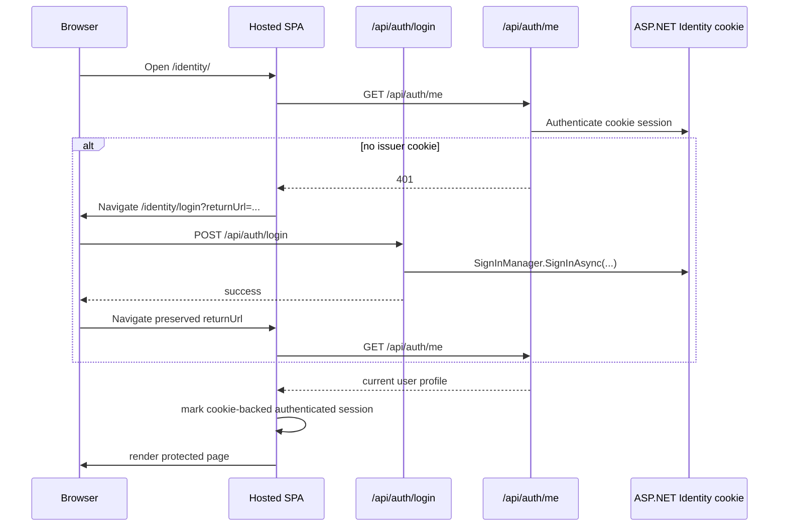
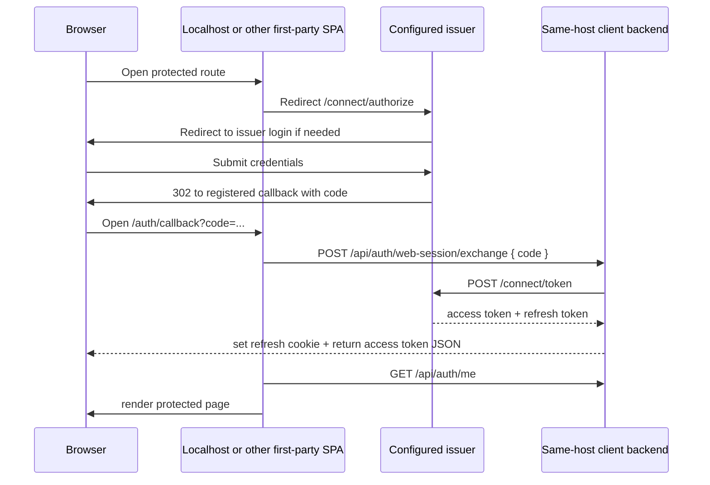

# Identity Login Flows

This document describes the current browser authentication model in `OpenSaur.Identity.Web`.

For generic downstream client integration guidance, see `docs/identity-client-integration.md`.

The important rule is:

- if the current host is the configured `Oidc:Issuer`, the hosted shell uses the issuer's ASP.NET Identity cookie directly
- if the current host is not the configured issuer, the shell behaves like a normal first-party OIDC client and uses the authorization-code callback flow

## Scenario Matrix

These are client categories. Any concrete URL like `contentwriter`, `cms`, or `registers` is only an example of one of these categories, not a hardcoded product shape.

| Client category | Example only | Issuer host? | Login happens on | Return target |
|---|---|---:|---|---|
| Current Identity shell on a non-issuer host | `http://localhost:<port>/<issuer-app-base>` | No | `https://<issuer-host>/<issuer-app-base>/login` | the exact preserved non-issuer `.../<issuer-app-base>/...` route |
| Current Identity shell on the issuer host | `https://<issuer-host>/<issuer-app-base>` | Yes | `https://<issuer-host>/<issuer-app-base>/login` | the exact preserved issuer `.../<issuer-app-base>/...` route |
| Future SPA client on another host or path base | `http://localhost:<port>/<app-base>` | No | `https://<issuer-host>/<issuer-app-base>/login` | the exact preserved `.../<app-base>/...` route |
| Future SPA client on the same origin but not the issuer path base | `https://<issuer-host>/<other-app-base>` | No | `https://<issuer-host>/<issuer-app-base>/login` | the exact preserved `.../<other-app-base>/...` route |
| Future server-rendered or backend-managed web client on another host | `http://localhost:<port>/<backend-app>` | No | `https://<issuer-host>/<issuer-app-base>/login` | the exact preserved backend-owned route |
| Future server-rendered or backend-managed web client on the same origin but a different path base | `https://<issuer-host>/<backend-app>` | No | `https://<issuer-host>/<issuer-app-base>/login` | the exact preserved backend-owned route |
| Future separate subdomain client | `https://<client-host>` | No | `https://<issuer-host>/<issuer-app-base>/login` | the exact preserved client route |

Important clarification:

- `https://<issuer-host>/<issuer-app-base>` is the issuer
- any other host or path base is a client, even if it shares the same domain origin
- the identity of the issuer is determined by exact issuer base URI, not by "same domain" alone

## Runtime Modes

### 1. Issuer-hosted mode

Example:

- `current host = https://<issuer-host>/<issuer-app-base>`
- `Oidc:Issuer = https://<issuer-host>/<issuer-app-base>`

Characteristics:

- login UI is hosted locally on the issuer host
- protected SPA bootstrap uses `GET /api/auth/me`
- API requests are authorized by the issuer cookie
- the frontend does not run `/connect/authorize` against itself for ordinary sign-in
- the frontend does not use `/api/auth/web-session/exchange` or `/api/auth/web-session/refresh`
- no access token is stored in browser JavaScript for this mode

### 2. External first-party client mode

Examples:

- `current host = http://localhost:<port>/<issuer-app-base>`
- `Oidc:Issuer = https://<issuer-host>/<issuer-app-base>`

Characteristics:

- the client redirects to the configured issuer for login
- the issuer returns an authorization code to the client's exact registered callback URI
- the client posts that `code` to `/api/auth/web-session/exchange`
- the client stores an access token in memory only
- the client stores a refresh token in a host-owned `HttpOnly` cookie

### 3. Server-rendered or backend-managed client mode

Examples:

- `http://localhost:<port>/<backend-app>`
- `https://<issuer-host>/<backend-app>`
- `https://<client-host>`

Characteristics:

- the app still redirects to `https://<issuer-host>/<issuer-app-base>/login`
- the app uses the standard authorization-code flow for its own backend or framework middleware
- the app does not use the React shell's `/api/auth/web-session/exchange` pattern unless it intentionally adopts the same first-party SPA helper model
- callback ownership still depends on exact registered redirect URIs

## Main Code Paths

Frontend:

- router: `src/OpenSaur.Identity.Web/client/src/app/router/AppRouter.tsx`
- bootstrap boundary: `src/OpenSaur.Identity.Web/client/src/features/auth/components/AuthBootstrapBoundary.tsx`
- protected guard: `src/OpenSaur.Identity.Web/client/src/features/auth/components/ProtectedRoute.tsx`
- bootstrap logic: `src/OpenSaur.Identity.Web/client/src/features/auth/hooks/useAuthBootstrap.ts`
- login page: `src/OpenSaur.Identity.Web/client/src/pages/login/LoginPage.tsx`
- callback page: `src/OpenSaur.Identity.Web/client/src/pages/auth-callback/AuthCallbackPage.tsx`
- OIDC helpers: `src/OpenSaur.Identity.Web/client/src/features/auth/utils/firstPartyOidc.ts`
- runtime auth config bootstrap: `src/OpenSaur.Identity.Web/Infrastructure/Hosting/FrontendAppRoutes.cs`
- runtime auth config consumer: `src/OpenSaur.Identity.Web/client/src/shared/config/env.ts`
- in-memory session state: `src/OpenSaur.Identity.Web/client/src/features/auth/state/authSessionStore.ts`

Backend:

- endpoint wiring: `src/OpenSaur.Identity.Web/Program.cs`
- auth helpers: `src/OpenSaur.Identity.Web/Features/Auth/AuthEndpoints.cs`
- login API: `src/OpenSaur.Identity.Web/Features/Auth/Login/LoginHandler.cs`
- current-user API: `src/OpenSaur.Identity.Web/Features/Auth/Me/GetCurrentUserHandler.cs`
- OIDC authorize endpoint: `src/OpenSaur.Identity.Web/Features/Auth/Oidc/OidcEndpoints.cs`
- code exchange: `src/OpenSaur.Identity.Web/Features/Auth/WebSession/ExchangeWebSessionHandler.cs`
- refresh: `src/OpenSaur.Identity.Web/Features/Auth/WebSession/RefreshWebSessionHandler.cs`
- cookie challenge rules: `src/OpenSaur.Identity.Web/Infrastructure/DependencyInjection.cs`
- cookie claim enrichment for hosted mode: `src/OpenSaur.Identity.Web/Infrastructure/Security/IdentitySessionClaimsTransformation.cs`
- token client for non-issuer hosts: `src/OpenSaur.Identity.Web/Infrastructure/Oidc/FirstPartyOidcTokenClient.cs`
- first-party client config: `src/OpenSaur.Identity.Web/Infrastructure/Oidc/OidcOptions.cs`
- impersonation bridge: `src/OpenSaur.Identity.Web/Features/Auth/Impersonation/FirstPartyImpersonationBridge.cs`

## Runtime Configuration Contract

The first-party shell no longer relies on build-time frontend host defaults for issuer authority or callback ownership.

- the backend serves `/identity/app-config.js` from the current host
- that bootstrap payload contains the configured issuer, first-party client id, scope, current-host callback URI, and whether the current host is the issuer
- the frontend reads that payload through `shared/config/env.ts` before it decides whether to reuse the issuer cookie or start `/connect/authorize`

This keeps frontend auth-start behavior aligned with backend OIDC configuration and avoids hardcoding deployment-specific issuer hostnames into the built shell bundle.

## Browser Client Registration

The shared first-party browser client is currently:

- `first-party-web`

Registered callback URIs:

- `https://<issuer-host>/<issuer-app-base>/auth/callback`
- `http://localhost:<port>/<issuer-app-base>/auth/callback`

At runtime:

- the frontend always uses the same client id
- `resolveFirstPartyRedirectUri()` derives the callback candidate from the current origin
- the backend rejects callback URIs that are not explicitly registered

## Issuer-Hosted Flow

This is the normal flow when the shell runs on the same host as `Oidc:Issuer`.

Step-by-step:

1. The browser opens `/identity/`.
   - route setup: `AppRouter.tsx`
   - guard and bootstrap: `ProtectedRoute.tsx`, `AuthBootstrapBoundary.tsx`, `useAuthBootstrap.ts`

2. `useAuthBootstrap()` detects issuer-hosted mode with `isCurrentAppHostedByIssuer()`.
   - file: `firstPartyOidc.ts`

3. Instead of trying refresh-token recovery, hosted mode calls `fetchCurrentUser()`.
   - hook: `useCurrentUserQuery.ts`
   - API: `authApi.ts`

4. `GET /api/auth/me` is authorized by the ASP.NET Identity cookie.
   - route: `AuthEndpoints.cs`
   - handler: `GetCurrentUserHandler.cs`
   - API policy accepts both cookie and bearer auth in `DependencyInjection.cs`

5. Cookie-authenticated principals are enriched with application claims before authorization-sensitive handlers read them.
   - `IdentitySessionClaimsTransformation.cs`
   - adds workspace, role, password-change, and impersonation claims using the same effective-session model as JWT access tokens

6. If `/api/auth/me` succeeds, the frontend marks the session as authenticated without an access token.
   - `authSessionStore.setCookieAuthenticatedSession()`

7. If `/api/auth/me` fails, bootstrap clears state and redirects to `/login?returnUrl=...`.

8. On the hosted login page, credentials are posted to `/api/auth/login`.
   - `LoginPage.tsx`
   - `LoginHandler.cs`

9. `SignInManager.SignInAsync(...)` establishes the issuer cookie.

10. After login succeeds, hosted mode navigates directly back to the preserved return URL.
    - no self-`/connect/authorize`
    - no self-callback exchange

## External First-Party Flow

This is the flow when the shell runs on a different host than `Oidc:Issuer`.

Code path:

1. `LoginPage.tsx` auto-starts `buildFirstPartyAuthorizeUrl(...)` and `startFirstPartyAuthorization(...)`.
2. `/connect/authorize` is handled by `OidcEndpoints.cs`.
3. The issuer login challenge is rewritten by cookie middleware in `DependencyInjection.cs`.
4. `AuthCallbackPage.tsx` posts the authorization `code` to `ExchangeWebSessionHandler.cs`.
5. `FirstPartyOidcTokenClient.cs` exchanges the code against the configured issuer `/connect/token`.
6. `RefreshWebSessionHandler.cs` rotates the client-host refresh cookie for later refresh.

## Impersonation Flow

Impersonation still uses the issuer as the only source of trust for session mutation.

Common start:

1. The SPA calls:
   - `POST /api/auth/impersonation/start`, or
   - `POST /api/auth/impersonation/exit`

2. The backend returns a signed issuer redirect URL.
   - `StartImpersonationHandler.cs`
   - `ExitImpersonationHandler.cs`
   - `FirstPartyImpersonationBridge.cs`

3. The browser performs a full-page redirect to the issuer bridge endpoint.

After that the flow splits:

- issuer-hosted shell:
  - the issuer updates its own cookie session
  - the bridge redirects directly back to the hosted return URL
  - hosted bootstrap reuses `/api/auth/me`

- non-issuer host:
  - the issuer updates its own cookie session
  - the bridge redirects through `/connect/authorize`
  - the client receives a fresh callback `code`
  - the client completes `/api/auth/web-session/exchange`

This keeps impersonation session mutation inside the issuer boundary without forcing the issuer host to self-run the OIDC callback exchange path.

## Token And Cookie Ownership

Issuer-hosted mode:

- issuer cookie: yes
- in-memory access token: no
- client refresh cookie: no

External first-party mode:

- issuer cookie: yes, on the issuer host only
- in-memory access token: yes, on the client host
- client refresh cookie: yes, on the client host

Important boundary:

- the issuer host and a localhost client do not share cookies or localStorage
- the only thing that crosses from issuer host to a non-issuer host is the one-time authorization code

## Localization And Preferences

Issuer handoff, callback, and exchange-failure screens use the current host's preference cache:

- provider: `src/OpenSaur.Identity.Web/client/src/features/preferences/PreferenceProvider.tsx`
- translations: `src/OpenSaur.Identity.Web/client/src/features/localization/resources.ts`

Important boundary:

- preferences are stored in `window.localStorage`
- the issuer host and a localhost client do not share the same storage bucket
- after successful authentication, `useSyncAuthenticatedPreferences()` syncs `/api/auth/settings` back into the current host's cache

## Failure Cases

Hosted issuer mode:

- `/api/auth/me` returns `401`
- bootstrap clears local state
- the browser is sent to `/login?returnUrl=...`

External first-party mode:

- `/api/auth/web-session/exchange` fails
- `AuthCallbackPage.tsx` clears local state
- the browser is sent to `/login?returnUrl=...&authError=exchange_failed`

Refresh-token mode on non-issuer hosts:

- `/api/auth/web-session/refresh` fails
- the SPA clears session state and returns to `/login`

## Operational Consequence

`BackchannelAuthority` is no longer required for the normal hosted shell flow.

Why:

- the issuer host no longer acts as an OIDC client of itself during ordinary sign-in
- only non-issuer hosts need the `/connect/token` backchannel exchange path
- those non-issuer hosts call the configured public issuer directly
