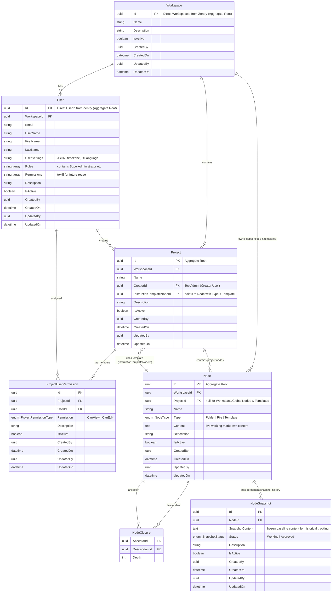
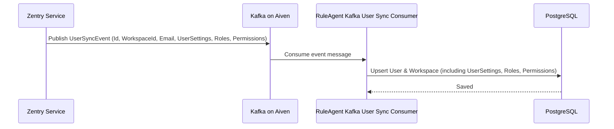
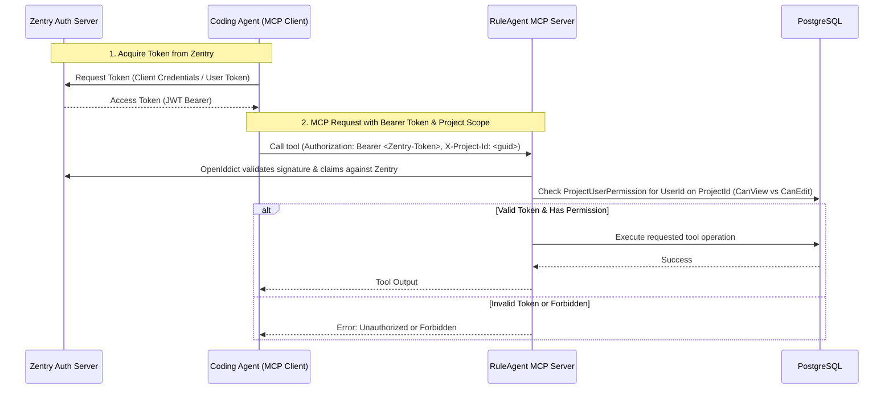

# RuleAgent Architecture and Requirements

## 1. Overview & Requirements
**RuleAgent** is a centralized application that connects to Coding Agents via the Model Context Protocol (MCP). Instead of Coding Agents creating physical markdown files directly on local machines (which prevents other developers from utilizing shared rules, prompts, skills, specs, and memories), RuleAgent acts as a central repository for all agentic documentation and guidelines.

### Key Requirements
- **Centralized Markdown Guidance**: Store rules, skills, prompts, and project specs in a single shared location across all developers.
- **Closure Table Folder/File Storage**: Provide a flexible hierarchical structure where folders can store child folders, content files, and templates.
- **Live Content Storage on Node**:
  - `Node` stores the active, live markdown content directly (`Content` field).
- **Permanent NodeSnapshot History & Diff Workflow**:
  - When starting work on a feature, a **`NodeSnapshot`** is created, freezing a baseline copy of the node's content (`Status = SnapshotStatus.Working`).
  - During development, the Coding Agent or developer can update `Node.Content` multiple times without altering the baseline snapshot.
  - Diff comparisons compare the live `Node.Content` against the active `NodeSnapshot.SnapshotContent` (or any historical snapshot).
  - When the developer explicitly approves the changes, the `NodeSnapshot` is marked as **`SnapshotStatus.Approved`**.
  - All historical snapshots are **retained permanently** in `NodeSnapshot` so developers can inspect the complete timeline of changes.
- **Unified Instruction Templates via Nodes & RBAC**:
  - Instruction templates are stored directly as `Node` entities with `Type = NodeType.Template` (`ProjectId = null`).
  - **SuperAdministrator Only**: Only users with the `SuperAdministrator` role can create, update, or delete instruction templates.
  - When creating a project, developers select an instruction template node (`InstructionTemplateNodeId`).
- **Workspace-Level Global Rules & Skills**:
  - Global files, folders, and templates belong directly to the `Workspace` (`ProjectId = null`).
  - Coding Agents can directly read workspace-wide global rules, instructions, and skills alongside project-specific documentation.
- **Authentication & OpenIddict (Zentry as Single Source of Truth)**:
  - **Zentry Authorization Server**: Zentry is the single authority for user identity, client credentials, and token issuance.
  - **Web UI Login**: OpenID Connect (OIDC) Authorization Code Flow with cookie session via Zentry, matching CashPilot setup.
  - **M2M Coding Agent Authentication**: Coding Agents authenticate using OAuth2 bearer tokens issued by Zentry, supplying the target `X-Project-Id` on requests.
  - **Token Validation**: RuleAgent uses OpenIddict validation middleware to validate all incoming bearer tokens directly against Zentry's authority.
  - **RuleAgent Authorization**: RuleAgent inspects the authenticated `UserId` from the token and enforces `CanView` vs `CanEdit` permissions via its local `ProjectUserPermission` table.
- **Workspaces & Users (Zentry Sync via Kafka on Aiven)**:
  - Workspaces and Users are synchronized from Zentry via Kafka (hosted on Aiven).
  - Uses direct `WorkspaceId` and `UserId` as primary keys (matching Zentry and CashPilot conventions, no `ExternalId` columns).
  - A workspace contains multiple users, and a user can belong to multiple projects.
  - Both `Workspace` and `User` include `IsActive` flags for soft-deactivation and access control.
  - `User` entity includes `UserSettings` (JSON for timezone, UI language), and `Roles` & `Permissions` (string arrays synced from Zentry for future authorization reuse).
- **Base Entity Standardization (Matching CashPilot)**:
  - All domain tables inherit standard audit and status fields (`Id`, `Description`, `IsActive`, `CreatedBy`, `CreatedOn`, `UpdatedBy`, `UpdatedOn`).
- **Project Permissions & Access Control**:
  - The project **Creator** is the top admin and the only one who can grant, update, or revoke project permissions for other users.
  - Project members are assigned either **`CanView`** (view only) or **`CanEdit`** (view and edit).
  - Users with `CanView` cannot make edits via the Web UI or via Coding Agent MCP operations (read-only enforced across both channels).
- **Web UI Management (Angular 19+)**: Modern responsive web interface for Phone, Tablet, and Desktop using Angular Material, Monaco Editor (with side-by-side diff on desktop/tablet, inline diff on phone), and Native Angular 19 Signals + `HttpClient`. Visual design (Header, Profile menu, Settings page, Side menu, List pages, and Edit drawers) follows the clean aesthetic of CashPilot using native CSS custom properties.
- **MCP Server for Coding Agents**: Coding agents authenticate via Zentry bearer tokens and manage folders/files directly via MCP tools instead of local file I/O, respecting user access levels.

---

## 2. System Architecture & Tech Stack

| Layer | Technology | Version / Details |
|---|---|---|
| **Architecture Pattern** | **Feature Slice Architecture + Domain-Driven Design (DDD)** | Vertical slices (`Features/<SliceName>`) with rich domain aggregate roots (`IAggregateRoot`), encapsulated state methods, and pure handlers without direct `HttpContext`. |
| **Backend API** | ASP.NET Core Minimal API | **.NET 10** (Minimal API, endpoint/handler separation, strongly-typed DTOs) |
| **Authentication & OIDC** | **OpenIddict & Cookie/OIDC (Zentry Authority)** | Zentry OIDC authority as single source of truth, OpenIddict token validation, Cookie auth for Web UI |
| **Database** | PostgreSQL | Relational database with Closure Table schema |
| **ORM** | Entity Framework Core | **EF Core 10** (Npgsql) |
| **Message Broker (Sync)** | Apache Kafka (Aiven) | **Confluent.Kafka** (idiomatic background consumer syncing Users & Workspaces from Zentry) |
| **MCP Server** | C# MCP SDK / SSE/HTTP Transport | Exposes tools for Coding Agents over SSE/HTTP authenticated via Zentry bearer tokens |
| **Frontend Framework** | Angular | **Angular 19+** (Standalone Components) |
| **Responsive Support** | **Phone, Tablet & Desktop** | Powered by Angular CDK `BreakpointObserver`, CSS Flex/Grid media queries, collapsible drawers, adaptive Monaco diff view |
| **UI Component Library** | **Angular Material** | **`@angular/material`** (Material Design, CDK Tree for File Explorer, Dialogs, Menus, Sidenav Drawers) |
| **UI Design System** | **CashPilot-aligned Style** | Brand `#00ccff`, soft background `#edf3f8`, `"Be Vietnam Pro"` font, clean cards, header, profile, side menu, List pages, and Edit drawers implemented natively via CSS tokens |
| **State & Data Fetching** | **Native Signals + `HttpClient`** | 100% stable, official Angular Signals (`signal`, `computed`, `effect`) and `HttpClient` service pattern |
| **Editor & Diff Engine** | **Monaco Editor** | `ngx-monaco-editor-v2` / `monaco-editor` (VS Code engine, Markdown editor, Side-by-Side Diff on Desktop/Tablet, Inline Diff on Mobile) |
| **Markdown Preview** | **`ngx-markdown`** | HTML preview with GFM, syntax highlighting, and Mermaid diagram support |

---

## 3. Data Model (Domain-Driven Design)

### Domain Interfaces
- **`IEntityBase`**: Common entity audit contract (`Id`, `CreatedBy`, `CreatedOn`, `UpdatedBy`, `UpdatedOn`).
- **`EntityBase`**: Abstract base class (`IEntityBase`, `Description`, `IsActive = true`).
- **`IAggregateRoot`**: Marker interface for DDD aggregate root boundaries (`Workspace`, `User`, `Project`, `Node`).

### Domain Enums
- **`NodeType`**: `Folder = 1`, `File = 2`, `Template = 3`
- **`ProjectPermissionType`**: `CanView = 1`, `CanEdit = 2`
- **`SnapshotStatus`**: `Working = 1`, `Approved = 2`

### Entity Relationship Diagram

### Access Control Rules
1. **Creator (Top Admin)**: User who created the project (`CreatorId`). Has full permissions and is the only person permitted to assign, modify, or revoke permissions for other users on that project.
2. **`CanEdit`**: Can create, update, move, delete folders/files, and take or approve snapshots.
3. **`CanView`**: Read-only access. Blocked from write actions across both Web UI and MCP API tools.
4. **`SuperAdministrator`**: Only users having the `SuperAdministrator` role in `User.Roles` can create, edit, or delete instruction templates (`Type = NodeType.Template`).

---

## 4. Zentry Sync Integration Flow (Kafka on Aiven)

---

## 5. Machine-to-Machine MCP Authentication & Integration Flow

---

## 6. Features Reference Breakdown

### Feature 001 — Foundation, Auth (OIDC/OpenIddict) & Zentry Kafka Sync
- Create ASP.NET Core 10 Web API project using Feature Slice Architecture (`Domain/`, `Features/`, `Infrastructure/`)
- Set up EF Core 10 with PostgreSQL
- Create `EntityBase` class (`Id`, `Description`, `IsActive`, `CreatedBy`, `CreatedOn`, `UpdatedBy`, `UpdatedOn`) and `IAggregateRoot`
- Implement domain entities with DDD patterns and enums: `Workspace`, `User`, `Project`, `ProjectUserPermission`, `Node`, `NodeClosure`, `NodeSnapshot`
- Implement Auth slice (`Features/Auth/`): OpenIddict validation against Zentry authority, Zentry OIDC with cookie session for Web UI, current session/profile endpoint, token refresh
- Implement Kafka consumer service (`Infrastructure/Messaging/`) for syncing `UserSyncEvent` from Aiven
- Implement Project CRUD slice (`Features/Projects/`) with Creator top-admin role assignment
- Implement Project permission management slice (`Features/ProjectPermissions/`)

### Feature 002 — Folder & File Management (Closure Table)
- Implement Closure Table slice (`Features/Nodes/`)
- Create folder and file/template under a parent folder
- Move folder/file to a new parent (updating closure relationships)
- Rename folder/file
- Soft-delete folder/file (with cascading closure cleanups)
- Full tree and direct children queries
- Ancestor breadcrumb queries
- Project member view/edit permission enforcement across all node operations

### Feature 003 — Node Content & NodeSnapshot History
- Implement snapshot slice (`Features/Snapshots/`)
- Update live `Node.Content` directly (requires `CanEdit` or Creator)
- Create `NodeSnapshot` baseline when beginning a feature (`Status = SnapshotStatus.Working`)
- Retrieve live content and full snapshot history (`ORDER BY CreatedOn DESC`)
- Compare live content vs active snapshot (or any historical snapshot) for side-by-side diff
- Explicit user approval: mark `NodeSnapshot` as `SnapshotStatus.Approved` (retaining all history permanently)

### Feature 004 — Instruction Templates (Unified via Node with SuperAdministrator Check)
- Implement templates slice (`Features/Templates/`)
- CRUD for instruction templates (`Node` with `Type = NodeType.Template` and `ProjectId = null`)
- Enforce `SuperAdministrator` role requirement on template creation, update, and deletion
- Assign template node when creating a project (`Project.InstructionTemplateNodeId`)
- Snapshot and diffing support for template updates via `NodeSnapshot`
- Retrieve active instruction template rules for a project

### Feature 005 — Workspace Global Rules & Skills
- Implement global rules slice (`Features/GlobalRules/`)
- CRUD for workspace-level global files and folders (`ProjectId = null`)
- Query workspace global tree separately or alongside project tree
- Manage global agent rules, skills, and coding standards

### Feature 006 — MCP Server (Zentry Bearer Token Authentication)
- Implement MCP slice (`Features/Mcp/`) with SSE/HTTP transport
- Authenticate MCP requests using Zentry OAuth2 bearer token header + `X-Project-Id`, validated via OpenIddict
- MCP tools: `list_workspace_global_tree`, `list_project_tree`, `read_file`, `create_node_snapshot`, `get_node_diff`, `get_snapshot_history`, `update_file`, `approve_node_snapshot`, `create_folder`, `create_file`, `delete_node`, `move_node`, `get_template_rules`

### Feature 007 — Web UI (Angular 19+ & Angular Material)
- Establish CashPilot-aligned design system in Angular (Material 3 theme, CSS custom properties, `"Be Vietnam Pro"` font, clean card surfaces, responsive layout tokens)
- Implement Responsive Header component (logo, hamburger menu for mobile/tablet, workspace/project switcher, CashPilot-style User Profile menu)
- Implement Responsive Side Menu navigation component (permanent on desktop, slide-out overlay drawer on mobile/tablet)
- Implement reusable responsive List Page & Data Table layout (adaptive horizontal scroll/card layout on mobile, clean action header)
- Implement reusable Create/Edit Form Drawer layout (slide-over on desktop/tablet, full-width 100% on phone)
- Implement User Settings page (timezone selection, UI language switcher, matching CashPilot card layout)
- Implement Project list & creation/edit drawer (Project Name, Instruction Template selection)
- Implement Project member permission management dialog for Project Creators to assign `CanView` vs `CanEdit`
- Implement Instruction Templates management view (restricted to `SuperAdministrator` role)
- Implement responsive File Explorer tree view component using Angular Material (`mat-tree` / CDK Tree) with collapsible sidebar toggle for mobile
- Workspace global rules management view
- Markdown preview (`ngx-markdown`) and Monaco Editor component (read-only when `CanView`)
- Snapshot history panel & Monaco Diff viewer (side-by-side on desktop/tablet, inline diff on phone)
- Explicit "Approve Changes" action button with confirmation dialog
