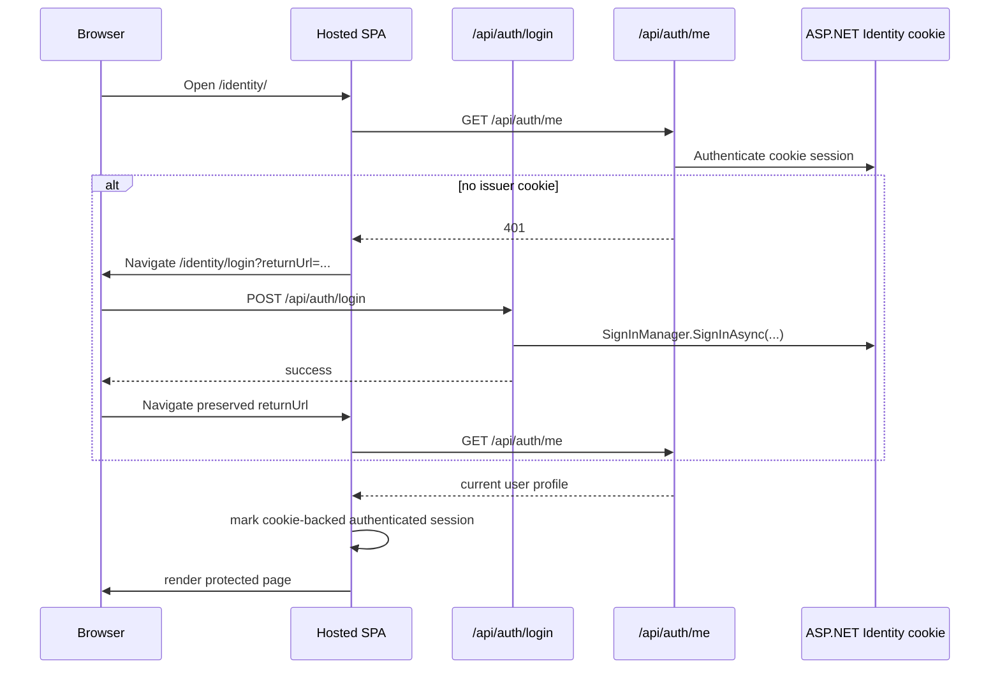
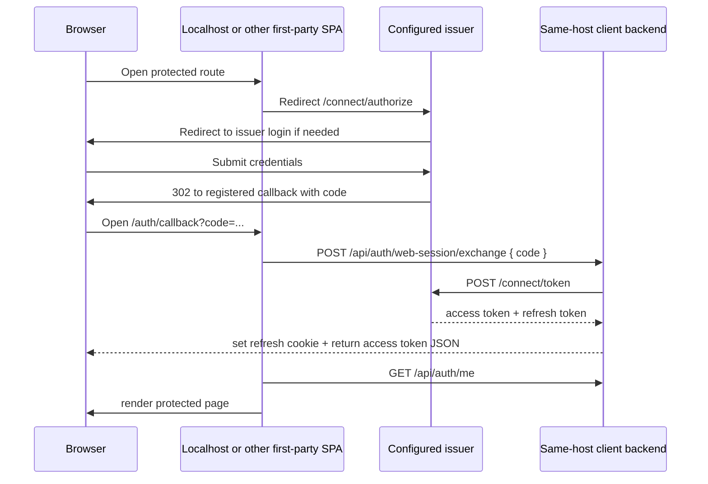

# Identity Login Flows

This document describes the current browser authentication model in `OpenSaur.Identity.Web`.

For generic downstream client integration guidance, see `docs/identity-client-integration.md`.

The important rule is:

- if the current app's effective public base URI exactly matches `Oidc:Issuer`, the hosted shell uses the issuer's ASP.NET Identity cookie directly
- if the current app's effective public base URI does not match the configured issuer, the shell behaves like a normal first-party OIDC client and uses the authorization-code callback flow

`Oidc:CurrentAppBaseUri` exists to make that comparison stable when the app is running behind proxies, gateways, tunnels, or CDNs.

## Scenario Matrix

These are client categories. Any concrete URL like `contentwriter`, `cms`, or `registers` is only an example of one of these categories, not a hardcoded product shape.

| Client category | Example only | Issuer host? | Login happens on | Return target |
|---|---|---:|---|---|
| Current Identity shell on a non-issuer host | `http://localhost:<port>/<issuer-app-base>` | No | `https://<issuer-host>/<issuer-app-base>/login` | the exact preserved non-issuer `.../<issuer-app-base>/...` route |
| Current Identity shell on the issuer host | `https://<issuer-host>/<issuer-app-base>` | Yes | `https://<issuer-host>/<issuer-app-base>/login` | the exact preserved issuer `.../<issuer-app-base>/...` route |
| Future SPA client on another host or path base | `http://localhost:<port>/<app-base>` | No | `https://<issuer-host>/<issuer-app-base>/login` | the exact preserved `.../<app-base>/...` route |
| Future SPA client on the same origin but not the issuer path base | `https://<issuer-host>/<other-app-base>` | No | `https://<issuer-host>/<issuer-app-base>/login` | the exact preserved `.../<other-app-base>/...` route |
| Future server-rendered or backend-managed web client on another host | `http://localhost:<port>/<backend-app>` | No | `https://<issuer-host>/<issuer-app-base>/login` | the exact preserved backend-owned route |
| Future server-rendered or backend-managed web client on the same origin but a different path base | `https://<issuer-host>/<backend-app>` | No | `https://<issuer-host>/<issuer-app-base>/login` | the exact preserved backend-owned route |
| Future separate subdomain client | `https://<client-host>` | No | `https://<issuer-host>/<issuer-app-base>/login` | the exact preserved client route |

Important clarification:

- `https://<issuer-host>/<issuer-app-base>` is the issuer
- any other host or path base is a client, even if it shares the same domain origin
- the identity of the issuer is determined by exact issuer base URI, not by "same domain" alone
- when reverse proxies rewrite or hide the browser-visible host, `Oidc:CurrentAppBaseUri` becomes the source of truth for callback generation and issuer-hosted-mode detection

## Runtime Modes

### 1. Issuer-hosted mode

Example:

- `current host = https://<issuer-host>/<issuer-app-base>`
- `Oidc:Issuer = https://<issuer-host>/<issuer-app-base>`

Characteristics:

- login UI is hosted locally on the issuer host
- protected SPA bootstrap uses `GET /api/auth/me`
- API requests are authorized by the issuer cookie
- the frontend does not run `/connect/authorize` against itself for ordinary sign-in
- the frontend does not use `/api/auth/web-session/exchange` or `/api/auth/web-session/refresh`
- no access token is stored in browser JavaScript for this mode

### 2. External first-party client mode

Examples:

- `current host = http://localhost:<port>/<issuer-app-base>`
- `Oidc:Issuer = https://<issuer-host>/<issuer-app-base>`

Characteristics:

- the client redirects to the configured issuer for login
- the issuer returns an authorization code to the client's exact registered callback URI
- the client posts that `code` to `/api/auth/web-session/exchange`
- the client stores an access token in memory only
- the client stores a refresh token in a host-owned `HttpOnly` cookie

### 3. Server-rendered or backend-managed client mode

Examples:

- `http://localhost:<port>/<backend-app>`
- `https://<issuer-host>/<backend-app>`
- `https://<client-host>`

Characteristics:

- the app still redirects to `https://<issuer-host>/<issuer-app-base>/login`
- the app uses the standard authorization-code flow for its own backend or framework middleware
- the app does not use the React shell's `/api/auth/web-session/exchange` pattern unless it intentionally adopts the same first-party SPA helper model
- callback ownership still depends on exact registered redirect URIs

## Main Code Paths

Frontend:

- router: `src/OpenSaur.Identity.Web/client/src/app/router/AppRouter.tsx`
- bootstrap boundary: `src/OpenSaur.Identity.Web/client/src/features/auth/components/AuthBootstrapBoundary.tsx`
- protected guard: `src/OpenSaur.Identity.Web/client/src/features/auth/components/ProtectedRoute.tsx`
- bootstrap logic: `src/OpenSaur.Identity.Web/client/src/features/auth/hooks/useAuthBootstrap.ts`
- login page: `src/OpenSaur.Identity.Web/client/src/pages/login/LoginPage.tsx`
- callback page: `src/OpenSaur.Identity.Web/client/src/pages/auth-callback/AuthCallbackPage.tsx`
- OIDC helpers: `src/OpenSaur.Identity.Web/client/src/features/auth/utils/firstPartyOidc.ts`
- runtime auth config consumer: `src/OpenSaur.Identity.Web/client/src/shared/config/env.ts`
- app-base-aware browser navigation: `src/OpenSaur.Identity.Web/client/src/shared/config/appBasePath.ts`
- in-memory session state: `src/OpenSaur.Identity.Web/client/src/features/auth/state/authSessionStore.ts`

Backend:

- endpoint wiring: `src/OpenSaur.Identity.Web/Program.cs`
- runtime auth config bootstrap and shell route serving: `src/OpenSaur.Identity.Web/Infrastructure/Hosting/FrontendAppRoutes.cs`
- managed client admin endpoints: `src/OpenSaur.Identity.Web/Features/OidcClients/OidcClientEndpoints.cs`
- auth helpers: `src/OpenSaur.Identity.Web/Features/Auth/AuthEndpoints.cs`
- login API: `src/OpenSaur.Identity.Web/Features/Auth/Login/LoginHandler.cs`
- current-user API: `src/OpenSaur.Identity.Web/Features/Auth/Me/GetCurrentUserHandler.cs`
- OIDC authorize endpoint: `src/OpenSaur.Identity.Web/Features/Auth/Oidc/OidcEndpoints.cs`
- code exchange: `src/OpenSaur.Identity.Web/Features/Auth/WebSession/ExchangeWebSessionHandler.cs`
- refresh: `src/OpenSaur.Identity.Web/Features/Auth/WebSession/RefreshWebSessionHandler.cs`
- cookie challenge rules: `src/OpenSaur.Identity.Web/Infrastructure/DependencyInjection.cs`
- cookie claim enrichment for hosted mode: `src/OpenSaur.Identity.Web/Infrastructure/Security/IdentitySessionClaimsTransformation.cs`
- token client for non-issuer hosts: `src/OpenSaur.Identity.Web/Infrastructure/Oidc/FirstPartyOidcTokenClient.cs`
- first-party client config: `src/OpenSaur.Identity.Web/Infrastructure/Oidc/OidcOptions.cs`
- managed client resolver and OpenIddict synchronizer: `src/OpenSaur.Identity.Web/Infrastructure/Oidc/ManagedOidcClientResolver.cs`, `src/OpenSaur.Identity.Web/Infrastructure/Oidc/ManagedOidcClientSynchronizer.cs`
- public-base-uri and redirect helpers: `src/OpenSaur.Identity.Web/Infrastructure/Oidc/OidcOptionsExtensions.cs`
- impersonation bridge: `src/OpenSaur.Identity.Web/Features/Auth/Impersonation/FirstPartyImpersonationBridge.cs`

## Runtime Configuration Contract

The first-party shell no longer relies on build-time frontend host defaults for issuer authority or callback ownership.

- the backend serves `/identity/app-config.js` from the current host
- that bootstrap payload contains the configured issuer, first-party client id, scope, current-host callback URI, whether the current host is the issuer, and the public Google reCAPTCHA v3 login settings when enabled
- `Oidc.CurrentClient` identifies which managed OIDC client record belongs to that deployment
- the current public origin root and app path base are then validated against that managed client before the callback URI is composed
- the frontend reads that payload through `shared/config/env.ts` before it decides whether to reuse the issuer cookie or start `/connect/authorize`
- the backend also serves the hosted shell HTML with no-store headers for the same reason

This keeps frontend auth-start behavior aligned with backend OIDC configuration and avoids hardcoding deployment-specific issuer hostnames into the built shell bundle.

When the app runs behind one or more reverse proxies, the current public base URI can be pinned explicitly with `Oidc:CurrentAppBaseUri`. That avoids leaking internal proxy or container hostnames into generated callback URIs when forwarded-host metadata is incomplete or rewritten upstream.

The runtime auth bootstrap and hosted shell HTML routes must be treated as non-cacheable content by the app and by any intermediary CDN or reverse proxy. If `/identity/app-config.js` or the hosted shell entry HTML is cached across deployments, the browser can receive stale `redirectUri` or `isIssuerHostedApp` values and start the wrong auth flow.

For the current Identity shell, the browser-visible runtime config should always satisfy:

- hosted issuer deployment: `redirectUri = https://<issuer-host>/<issuer-app-base>/auth/callback` and `isIssuerHostedApp = true`
- localhost or another non-issuer client deployment: `redirectUri = http://localhost:<port>/<issuer-app-base>/auth/callback` (or that client's own registered callback) and `isIssuerHostedApp = false`

## Managed Browser Client Registration

The issuer now treats first-party browser clients as managed data:

- `Oidc.BootstrapClient` exists only to seed the initial client when the managed-client tables are empty
- `Oidc.CurrentClient` identifies which existing managed client belongs to the current deployment
- long-term client management lives in the application database
- each managed client stores:
  - `ClientId`
  - `ClientSecret`
  - `DisplayName`
  - `Scope`
  - `AppPathBase`
  - `CallbackPath`
  - `PostLogoutPath`
  - public origin roots such as `https://app.example.com/` or `http://localhost:5220/`

Exact redirect and post-logout redirect URIs are derived by combining:

- managed origin root
- managed app path base
- managed callback and post-logout paths for that client

At runtime:

- the frontend receives the resolved current client id from runtime config
- the backend derives the current callback URI from the current managed client plus that client's `CallbackPath`
- the backend derives the post-logout redirect URI from the current managed client plus that client's `PostLogoutPath`
- OpenIddict still validates exact redirect URIs, because the synchronizer writes those exact derived URIs into the OpenIddict application record

## Issuer-Hosted Flow

This is the normal flow when the shell runs on the same host as `Oidc:Issuer`.



Step-by-step:

1. The browser opens `/identity/`.
   - route setup: `AppRouter.tsx`
   - guard and bootstrap: `ProtectedRoute.tsx`, `AuthBootstrapBoundary.tsx`, `useAuthBootstrap.ts`

2. `useAuthBootstrap()` detects issuer-hosted mode with `isCurrentAppHostedByIssuer()`.
   - file: `firstPartyOidc.ts`

3. Instead of trying refresh-token recovery, hosted mode calls `fetchCurrentUser()`.
   - hook: `useCurrentUserQuery.ts`
   - API: `authApi.ts`

4. `GET /api/auth/me` is authorized by the ASP.NET Identity cookie.
   - route: `AuthEndpoints.cs`
   - handler: `GetCurrentUserHandler.cs`
   - API policy accepts both cookie and bearer auth in `DependencyInjection.cs`
   - issuer-hosted-mode detection comes from runtime config served by `FrontendAppRoutes.cs`

5. Cookie-authenticated principals are enriched with application claims before authorization-sensitive handlers read them.
   - `IdentitySessionClaimsTransformation.cs`
   - adds workspace, role, password-change, and impersonation claims using the same effective-session model as JWT access tokens

6. If `/api/auth/me` succeeds, the frontend marks the session as authenticated without an access token.
   - `authSessionStore.setCookieAuthenticatedSession()`

7. If `/api/auth/me` fails, bootstrap clears state and redirects to `/login?returnUrl=...`.

8. On the hosted login page, credentials are posted to `/api/auth/login`.
   - `LoginPage.tsx`
   - `LoginHandler.cs`
   - when `GoogleRecaptchaV3` is configured, the hosted login page first acquires a Google reCAPTCHA v3 token from the browser and includes it in the same login payload

9. `SignInManager.SignInAsync(...)` establishes the issuer cookie.
   - before password validation, `LoginHandler.cs` verifies the Google reCAPTCHA v3 token when the feature is configured

10. After login succeeds, hosted mode navigates directly back to the preserved return URL.
    - no self-`/connect/authorize`
    - no self-callback exchange
    - app-relative routes stay under the configured app base, so `/` resolves back to `/identity/` for the hosted shell instead of the domain root

## External First-Party Flow

This is the flow when the shell runs on a different host than `Oidc:Issuer`.



Code path:

1. `LoginPage.tsx` auto-starts `buildFirstPartyAuthorizeUrl(...)` and `startFirstPartyAuthorization(...)`.
2. `/connect/authorize` is handled by `OidcEndpoints.cs`.
3. The issuer login challenge is rewritten by cookie middleware in `DependencyInjection.cs`.
4. `AuthCallbackPage.tsx` posts the authorization `code` to `ExchangeWebSessionHandler.cs`.
5. `FirstPartyOidcTokenClient.cs` exchanges the code against the configured issuer `/connect/token`.
6. `RefreshWebSessionHandler.cs` rotates the client-host refresh cookie for later refresh.

The hosted login page may still appear on the issuer during a localhost or other non-issuer flow, but the callback ownership stays with the requesting client host. The issuer only returns a one-time authorization code; it does not transfer its cookie or localStorage state to the client host.

## Impersonation Flow

Impersonation still uses the issuer as the only source of trust for session mutation.

Common start:

1. The SPA calls:
   - `POST /api/auth/impersonation/start`, or
   - `POST /api/auth/impersonation/exit`

2. The backend returns a signed issuer redirect URL.
   - `StartImpersonationHandler.cs`
   - `ExitImpersonationHandler.cs`
   - `FirstPartyImpersonationBridge.cs`

3. The browser performs a full-page redirect to the issuer bridge endpoint.

After that the flow splits:

- issuer-hosted shell:
  - the issuer updates its own cookie session
  - the bridge redirects directly back to the hosted return URL
  - hosted bootstrap reuses `/api/auth/me`

- non-issuer host:
  - the issuer updates its own cookie session
  - the bridge redirects through `/connect/authorize`
  - the client receives a fresh callback `code`
  - the client completes `/api/auth/web-session/exchange`

This keeps impersonation session mutation inside the issuer boundary without forcing the issuer host to self-run the OIDC callback exchange path.

## Token And Cookie Ownership

Issuer-hosted mode:

- issuer cookie: yes
- in-memory access token: no
- client refresh cookie: no

External first-party mode:

- issuer cookie: yes, on the issuer host only
- in-memory access token: yes, on the client host
- client refresh cookie: yes, on the client host

## Access Token Claims

When the issued token includes the `api` scope, the access token now carries:

- `sub`
- `name`
- `preferred_username`
- `email` when email scope is granted
- repeated `roles` claims when roles scope is granted
- repeated `permissions` claims with canonical permission-code strings such as `Administrator.CanManage`
- `workspace_id`
- password-change and impersonation state claims when applicable

The `permissions` claim is emitted from the issuer's effective DB-backed permission model and respects the active workspace or impersonation context. This lets downstream apps authorize against the token itself without querying the Identity database directly.

## JWT Claim Contract

The issuer-side claim factory is:

- `src/OpenSaur.Identity.Web/Features/Auth/AuthSessionPrincipalFactory.cs`

The canonical app-specific claim names are:

- `sub`
- `name`
- `preferred_username`
- `email`
- repeated `roles`
- repeated `permissions`
- `workspace_id`
- `require_password_change`
- `impersonation_active`
- `impersonation_original_user_id`
- `impersonation_workspace_id`

Important details:

- `roles` values are the normalized role names passed into the factory, not display names
- `permissions` values are canonical permission codes such as `Administrator.CanManage` or `Umbraco.CanManage`
- `workspace_id`, `impersonation_original_user_id`, and `impersonation_workspace_id` are emitted as GUID strings
- `require_password_change` and `impersonation_active` are emitted as lowercase string booleans: `"true"` or `"false"`
- OpenIddict also adds protocol claims such as `iss`, `aud`, `exp`, `iat`, and `jti`; those values vary by environment and request

### Claim Destination Rules

| Claim | `access_token` | `id_token` | Condition |
|---|---:|---:|---|
| `sub` | Yes | Yes | always |
| `name` | Yes | Yes | only when `profile` scope is granted |
| `preferred_username` | Yes | Yes | only when `profile` scope is granted |
| `email` | Yes | Yes | only when `email` scope is granted |
| `roles` | Yes | Yes | only when `roles` scope is granted |
| `permissions` | Yes | No | only when `api` scope is granted |
| `workspace_id` | Yes | No | always |
| `require_password_change` | Yes | No | always |
| `impersonation_active` | Yes | No | only when impersonation is active |
| `impersonation_original_user_id` | Yes | No | only when an original user id is present |
| `impersonation_workspace_id` | Yes | No | only when `workspaceOverrideId` is present |

### Sample Access Token Payload

This is an example payload shape for a normal non-impersonated session when scopes include:

- `openid profile email roles offline_access api`

```json
{
  "iss": "https://<issuer-host>/<issuer-app-base>",
  "aud": "api",
  "sub": "d2deace4-2350-42cd-bba6-c7b18cf54d39",
  "name": "SystemAdministrator",
  "preferred_username": "SystemAdministrator",
  "email": "SystemAdministrator@opensaur.local",
  "roles": [
    "SUPERADMINISTRATOR"
  ],
  "permissions": [
    "Administrator.CanManage",
    "Umbraco.CanManage"
  ],
  "workspace_id": "e3a2d95a-9d31-4232-b617-1ea4cdc65f88",
  "require_password_change": "true",
  "jti": "<token-id>",
  "iat": 1775510400,
  "exp": 1775514000
}
```

### Sample ID Token Payload

Using the same session and scopes, the matching `id_token` payload shape is:

```json
{
  "iss": "https://<issuer-host>/<issuer-app-base>",
  "aud": "first-party-web",
  "sub": "d2deace4-2350-42cd-bba6-c7b18cf54d39",
  "name": "SystemAdministrator",
  "preferred_username": "SystemAdministrator",
  "email": "SystemAdministrator@opensaur.local",
  "roles": [
    "SUPERADMINISTRATOR"
  ],
  "jti": "<token-id>",
  "iat": 1775510400,
  "exp": 1775514000
}
```

Notice that the `id_token` does not include:

- `permissions`
- `workspace_id`
- `require_password_change`
- impersonation state claims

### Sample Impersonated Access Token Payload

When the same flow is running under impersonation and the effective workspace has been overridden, the `access_token` payload shape becomes:

```json
{
  "iss": "https://<issuer-host>/<issuer-app-base>",
  "aud": "api",
  "sub": "<effective-user-id>",
  "name": "<effective-user-name>",
  "preferred_username": "<effective-user-name>",
  "email": "<effective-user-email>",
  "roles": [
    "ADMINISTRATOR"
  ],
  "permissions": [
    "Administrator.CanManage",
    "Umbraco.CanManage"
  ],
  "workspace_id": "<effective-workspace-id>",
  "require_password_change": "false",
  "impersonation_active": "true",
  "impersonation_original_user_id": "<original-super-admin-user-id>",
  "impersonation_workspace_id": "<effective-workspace-id>",
  "jti": "<token-id>",
  "iat": 1775510400,
  "exp": 1775514000
}
```

### Practical Reading Rules

- downstream APIs should use `permissions` for fine-grained authorization decisions
- downstream UIs can use `roles` for broad UX shaping, but those values are normalized names
- if a downstream app needs to know whether the current session is impersonated, it must read the access token, not the id token
- if a downstream app needs workspace context, it must read `workspace_id` from the access token, not the id token

Important boundary:

- the issuer host and a localhost client do not share cookies or localStorage
- the only thing that crosses from issuer host to a non-issuer host is the one-time authorization code

## Localization And Preferences

Issuer handoff, callback, and exchange-failure screens use the current host's preference cache:

- provider: `src/OpenSaur.Identity.Web/client/src/features/preferences/PreferenceProvider.tsx`
- translations: `src/OpenSaur.Identity.Web/client/src/features/localization/resources.ts`

Important boundary:

- preferences are stored in `window.localStorage`
- the issuer host and a localhost client do not share the same storage bucket
- after successful authentication, `useSyncAuthenticatedPreferences()` syncs `/api/auth/settings` back into the current host's cache

## Failure Cases

Hosted issuer mode:

- `/api/auth/me` returns `401`
- bootstrap clears local state
- the browser is sent to `/login?returnUrl=...`

External first-party mode:

- `/api/auth/web-session/exchange` fails
- `AuthCallbackPage.tsx` clears local state
- the browser is sent to `/login?returnUrl=...&authError=exchange_failed`

Refresh-token mode on non-issuer hosts:

- `/api/auth/web-session/refresh` fails
- the SPA clears session state and returns to `/login`

## Operational Consequence

`BackchannelAuthority` is no longer required for the normal hosted shell flow.

Why:

- the issuer host no longer acts as an OIDC client of itself during ordinary sign-in
- only non-issuer hosts need the `/connect/token` backchannel exchange path
- those non-issuer hosts call the configured public issuer directly

## Deployment Checklist

For a healthy deployment, keep these aligned:

- `Oidc:Issuer` must point to the public issuer base URI
- each deployment should set `Oidc:CurrentAppBaseUri` to its own browser-visible public base URI
- the managed OIDC client table must contain the correct public origin roots and app path base for each supported host
- each managed client record must contain the callback and post-logout paths that are composed with its managed origin roots
- `/identity/app-config.js` and hosted shell HTML must not be edge-cached
- hosted-shell login success should return to the app base route, not the domain root

## Managed Client Administration

The hosted shell now includes a super-administrator-only `/oidc-clients` page.

That page allows:

- create managed clients
- edit managed client id, secret, scope, app path base, and origins
- review derived redirect URIs
- deactivate clients without dropping audit history

Deactivation removes the matching active OpenIddict application registration, so the client can no longer start new authorization flows until it is reactivated.
